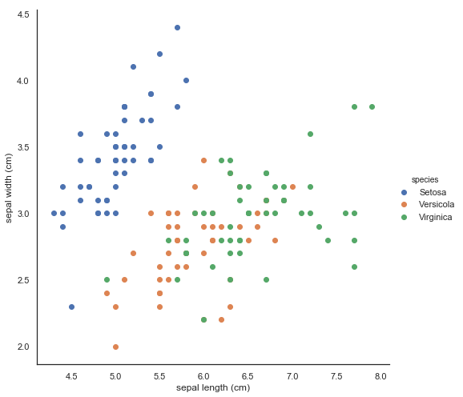
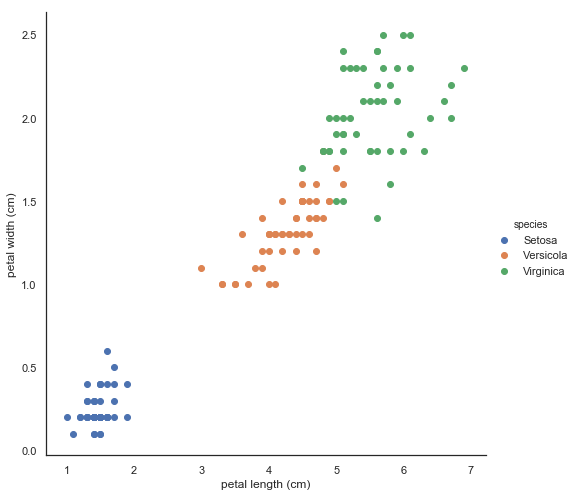
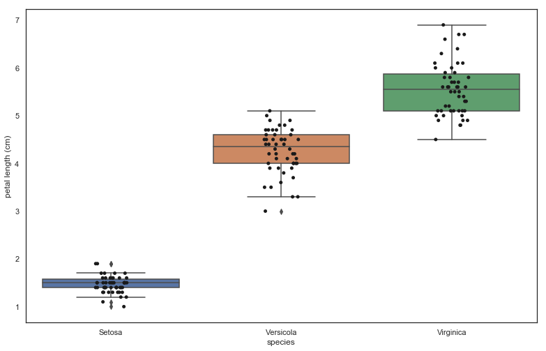
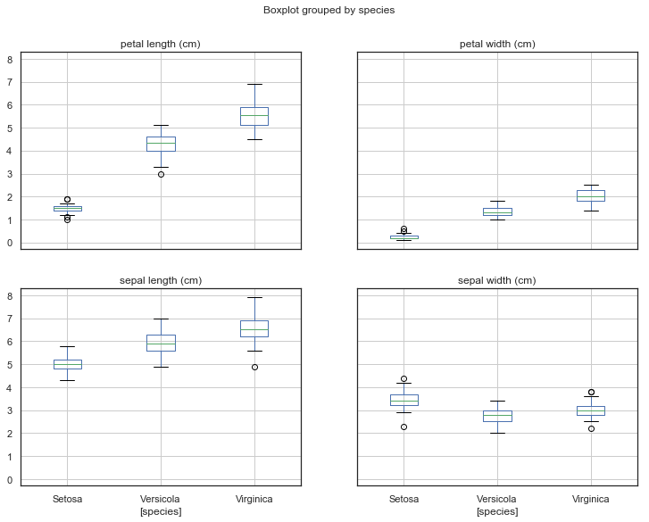
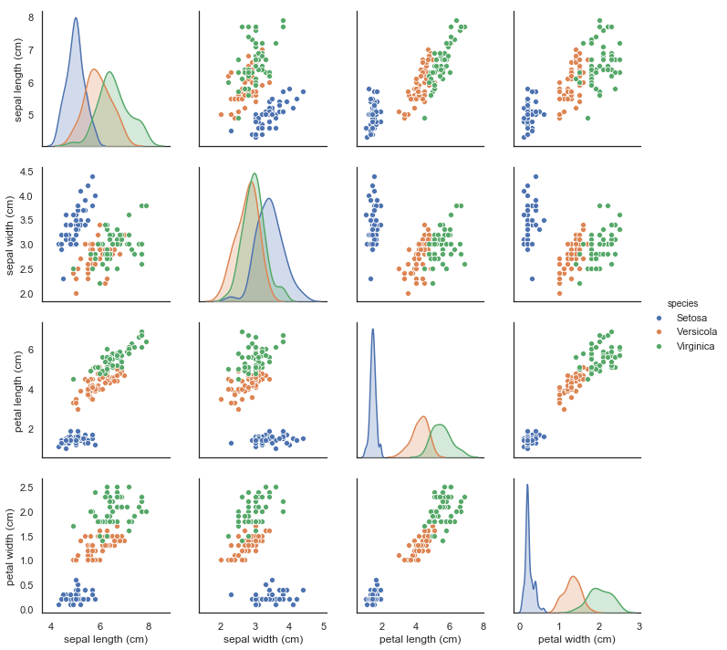

### Iris Dataset: EDA and simple ML modeling 
Iris dataset is conveniently included in Keras library and very basic tutorial dataset. 


```python
import numpy as np
import pandas as pd
import seaborn as sns

import matplotlib.pyplot as plt
sns.set(style='white', color_codes=True)
#plt.style.use('fivethirtyeight') 
#plt.rcParams['figure.figsize']=(11.7,8.27)
#fig.set_size_inches(11.7, 8.27)
# Initialize Figure and Axes object
#fig, ax = plt.subplots(figsize=(10,4))

%matplotlib inline
```


```python
# many warnings ignored
import warnings
warnings.filterwarnings("ignore")

```


```python
from sklearn.datasets import load_iris

iris = load_iris()
iris_data = iris.data
iris_label = iris.target
print('iris target value: ', iris.target)
print('iris target names: ', iris.target_names)


```

    iris target value:  [0 0 0 0 0 0 0 0 0 0 0 0 0 0 0 0 0 0 0 0 0 0 0 0 0 0 0 0 0 0 0 0 0 0 0 0 0
     0 0 0 0 0 0 0 0 0 0 0 0 0 1 1 1 1 1 1 1 1 1 1 1 1 1 1 1 1 1 1 1 1 1 1 1 1
     1 1 1 1 1 1 1 1 1 1 1 1 1 1 1 1 1 1 1 1 1 1 1 1 1 1 2 2 2 2 2 2 2 2 2 2 2
     2 2 2 2 2 2 2 2 2 2 2 2 2 2 2 2 2 2 2 2 2 2 2 2 2 2 2 2 2 2 2 2 2 2 2 2 2
     2 2]
    iris target names:  ['setosa' 'versicolor' 'virginica']
    


```python
iris_df = pd.DataFrame(data=iris_data, columns=iris.feature_names)
iris_df['label'] = pd.Series(iris_label)
# binomial choice case
#df['color'] = np.where(df['Set']=='Z', 'green', 'red')
iris_df['species']= np.select([iris_df['label']==0, iris_df['label']==1, iris_df['label']==2],
                              ['Setosa', 'Versicola', 'Virginica' ])

```


```python
iris_df.head(10)
```


<div>
<style scoped>
    .dataframe tbody tr th:only-of-type {
        vertical-align: middle;
    }

    .dataframe tbody tr th {
        vertical-align: top;
    }

    .dataframe thead th {
        text-align: right;
    }
</style>
<table border="1" class="dataframe">
  <thead>
    <tr style="text-align: right;">
      <th></th>
      <th>sepal length (cm)</th>
      <th>sepal width (cm)</th>
      <th>petal length (cm)</th>
      <th>petal width (cm)</th>
      <th>label</th>
      <th>species</th>
    </tr>
  </thead>
  <tbody>
    <tr>
      <th>0</th>
      <td>5.1</td>
      <td>3.5</td>
      <td>1.4</td>
      <td>0.2</td>
      <td>0</td>
      <td>Setosa</td>
    </tr>
    <tr>
      <th>1</th>
      <td>4.9</td>
      <td>3.0</td>
      <td>1.4</td>
      <td>0.2</td>
      <td>0</td>
      <td>Setosa</td>
    </tr>
    <tr>
      <th>2</th>
      <td>4.7</td>
      <td>3.2</td>
      <td>1.3</td>
      <td>0.2</td>
      <td>0</td>
      <td>Setosa</td>
    </tr>
    <tr>
      <th>3</th>
      <td>4.6</td>
      <td>3.1</td>
      <td>1.5</td>
      <td>0.2</td>
      <td>0</td>
      <td>Setosa</td>
    </tr>
    <tr>
      <th>4</th>
      <td>5.0</td>
      <td>3.6</td>
      <td>1.4</td>
      <td>0.2</td>
      <td>0</td>
      <td>Setosa</td>
    </tr>
    <tr>
      <th>5</th>
      <td>5.4</td>
      <td>3.9</td>
      <td>1.7</td>
      <td>0.4</td>
      <td>0</td>
      <td>Setosa</td>
    </tr>
    <tr>
      <th>6</th>
      <td>4.6</td>
      <td>3.4</td>
      <td>1.4</td>
      <td>0.3</td>
      <td>0</td>
      <td>Setosa</td>
    </tr>
    <tr>
      <th>7</th>
      <td>5.0</td>
      <td>3.4</td>
      <td>1.5</td>
      <td>0.2</td>
      <td>0</td>
      <td>Setosa</td>
    </tr>
    <tr>
      <th>8</th>
      <td>4.4</td>
      <td>2.9</td>
      <td>1.4</td>
      <td>0.2</td>
      <td>0</td>
      <td>Setosa</td>
    </tr>
    <tr>
      <th>9</th>
      <td>4.9</td>
      <td>3.1</td>
      <td>1.5</td>
      <td>0.1</td>
      <td>0</td>
      <td>Setosa</td>
    </tr>
  </tbody>
</table>
</div>


```python
iris_df.head()
```


<div>
<style scoped>
    .dataframe tbody tr th:only-of-type {
        vertical-align: middle;
    }

    .dataframe tbody tr th {
        vertical-align: top;
    }

    .dataframe thead th {
        text-align: right;
    }
</style>
<table border="1" class="dataframe">
  <thead>
    <tr style="text-align: right;">
      <th></th>
      <th>sepal length (cm)</th>
      <th>sepal width (cm)</th>
      <th>petal length (cm)</th>
      <th>petal width (cm)</th>
      <th>label</th>
      <th>species</th>
    </tr>
  </thead>
  <tbody>
    <tr>
      <th>0</th>
      <td>5.1</td>
      <td>3.5</td>
      <td>1.4</td>
      <td>0.2</td>
      <td>0</td>
      <td>Setosa</td>
    </tr>
    <tr>
      <th>1</th>
      <td>4.9</td>
      <td>3.0</td>
      <td>1.4</td>
      <td>0.2</td>
      <td>0</td>
      <td>Setosa</td>
    </tr>
    <tr>
      <th>2</th>
      <td>4.7</td>
      <td>3.2</td>
      <td>1.3</td>
      <td>0.2</td>
      <td>0</td>
      <td>Setosa</td>
    </tr>
    <tr>
      <th>3</th>
      <td>4.6</td>
      <td>3.1</td>
      <td>1.5</td>
      <td>0.2</td>
      <td>0</td>
      <td>Setosa</td>
    </tr>
    <tr>
      <th>4</th>
      <td>5.0</td>
      <td>3.6</td>
      <td>1.4</td>
      <td>0.2</td>
      <td>0</td>
      <td>Setosa</td>
    </tr>
  </tbody>
</table>
</div>


```python
# the size of A4 paper
sns.FacetGrid(iris_df, 
              hue='species', 
              size=7,
              ) \
             .map(plt.scatter, 
                  'sepal length (cm)', 
                  'sepal width (cm)') \
             .add_legend()

```


    <seaborn.axisgrid.FacetGrid at 0x2805f967da0>





```python
sns.FacetGrid(iris_df,
             hue='species', 
             size=7) \
            .map(plt.scatter,
                'petal length (cm)', 
                'petal width (cm)') \
             .add_legend()
```


    <seaborn.axisgrid.FacetGrid at 0x2805f6505c0>





```python
iris_df.describe().T
```


<div>
<style scoped>
    .dataframe tbody tr th:only-of-type {
        vertical-align: middle;
    }

    .dataframe tbody tr th {
        vertical-align: top;
    }

    .dataframe thead th {
        text-align: right;
    }
</style>
<table border="1" class="dataframe">
  <thead>
    <tr style="text-align: right;">
      <th></th>
      <th>count</th>
      <th>mean</th>
      <th>std</th>
      <th>min</th>
      <th>25%</th>
      <th>50%</th>
      <th>75%</th>
      <th>max</th>
    </tr>
  </thead>
  <tbody>
    <tr>
      <th>sepal length (cm)</th>
      <td>150.0</td>
      <td>5.843333</td>
      <td>0.828066</td>
      <td>4.3</td>
      <td>5.1</td>
      <td>5.80</td>
      <td>6.4</td>
      <td>7.9</td>
    </tr>
    <tr>
      <th>sepal width (cm)</th>
      <td>150.0</td>
      <td>3.057333</td>
      <td>0.435866</td>
      <td>2.0</td>
      <td>2.8</td>
      <td>3.00</td>
      <td>3.3</td>
      <td>4.4</td>
    </tr>
    <tr>
      <th>petal length (cm)</th>
      <td>150.0</td>
      <td>3.758000</td>
      <td>1.765298</td>
      <td>1.0</td>
      <td>1.6</td>
      <td>4.35</td>
      <td>5.1</td>
      <td>6.9</td>
    </tr>
    <tr>
      <th>petal width (cm)</th>
      <td>150.0</td>
      <td>1.199333</td>
      <td>0.762238</td>
      <td>0.1</td>
      <td>0.3</td>
      <td>1.30</td>
      <td>1.8</td>
      <td>2.5</td>
    </tr>
    <tr>
      <th>label</th>
      <td>150.0</td>
      <td>1.000000</td>
      <td>0.819232</td>
      <td>0.0</td>
      <td>0.0</td>
      <td>1.00</td>
      <td>2.0</td>
      <td>2.0</td>
    </tr>
  </tbody>
</table>
</div>


```python
iris_df.columns[0:4]
```


    Index(['sepal length (cm)', 'sepal width (cm)', 'petal length (cm)',
           'petal width (cm)'],
          dtype='object')


```python
# plot
#sns.set_style('ticks')
fig, ax = plt.subplots()
# the size of A4 paper
fig.set_size_inches(11.7, 8.27)

sns.boxplot(x='species', y='petal length (cm)', data=iris_df)
sns.stripplot(x='species', y='petal length (cm)', data=iris_df, jitter=True, color='k')
```


    <matplotlib.axes._subplots.AxesSubplot at 0x28063e10da0>





```python
iris_df.drop('label', axis=1).boxplot(by="species", figsize=(12, 9))
```


    array([[<matplotlib.axes._subplots.AxesSubplot object at 0x000002805FC5FDA0>,
            <matplotlib.axes._subplots.AxesSubplot object at 0x0000028060E74748>],
           [<matplotlib.axes._subplots.AxesSubplot object at 0x0000028060E9BE48>,
            <matplotlib.axes._subplots.AxesSubplot object at 0x0000028060EC9470>]],
          dtype=object)





```python
sns.pairplot(iris_df.drop('label', axis=1), hue='species')
```


    <seaborn.axisgrid.PairGrid at 0x280611dd160>





## Modeling


### Simple Iris Models


```python
from sklearn.tree import DecisionTreeClassifier
from sklearn.model_selection import train_test_split
from sklearn.metrics import accuracy_score

# Trainig and Data split
X_train, X_test, y_train, y_test = train_test_split(iris_data, iris_label, 
                                                    test_size=0.2, 
                                                    random_state=2019)
```


```python
# Decision Tree classifier
clf = DecisionTreeClassifier(random_state=2019)
```


```python
# Training
clf.fit(X_train, y_train)
```


    DecisionTreeClassifier(class_weight=None, criterion='gini', max_depth=None,
                max_features=None, max_leaf_nodes=None,
                min_impurity_decrease=0.0, min_impurity_split=None,
                min_samples_leaf=1, min_samples_split=2,
                min_weight_fraction_leaf=0.0, presort=False, random_state=2019,
                splitter='best')


```python
# prediction with test dataset
pred = clf.predict(X_test)
```


```python
print('prediction accuracy: [{0:4f}]'.format(accuracy_score(y_test, pred)))
```

    prediction accuracy: [0.966667]
    

### K-fold Cross Validation
To avoid overfitting and achieve better performance.
KFold object (5 folds) and accuracy for each fold


```python
# kfold objects (5 fold sets) and each fold accuracy containing list
kfold = KFold(n_splits=5)
cv_accuracy = []
print('Iris data size:', iris_data.shape[0])

```

    Iris data size: 150
    


```python
n_iter = 0

for train_index, test_index in kfold.split(iris_data):
    # train, validation test data extraction
    X_train, X_test = iris_data[train_index], iris_data[test_index]
    y_train, y_test = iris_label[train_index], iris_label[test_index]
    
    # learning/prediction
    clf.fit(X_train, y_train)
    pred = clf.predict(X_test)
    n_iter += 1
    
    # accuracy measure
    accuracy = np.round(accuracy_score(y_test, pred), 4)
    train_size = X_train.shape[0]
    test_size = X_test.shape[0]
    print('\n#{0} cross validation accuracy: {1}, size of train data: {2}, size of validation data: {3}'.format(n_iter, accuracy, train_size, test_size))
    print('#{0} validation data index: {1}'.format(n_iter, test_index))
    cv_accuracy.append(accuracy)
    
# average accuracy for all iteration
print('\n#### average validation accuracy: ', np.mean(cv_accuracy))
    
    
```

    
    #1 cross validation accuracy: 1.0, size of train data: 120, size of validation data: 30
    #1 validation data index: [ 0  1  2  3  4  5  6  7  8  9 10 11 12 13 14 15 16 17 18 19 20 21 22 23
     24 25 26 27 28 29]
    
    #2 cross validation accuracy: 1.0, size of train data: 120, size of validation data: 30
    #2 validation data index: [30 31 32 33 34 35 36 37 38 39 40 41 42 43 44 45 46 47 48 49 50 51 52 53
     54 55 56 57 58 59]
    
    #3 cross validation accuracy: 0.8667, size of train data: 120, size of validation data: 30
    #3 validation data index: [60 61 62 63 64 65 66 67 68 69 70 71 72 73 74 75 76 77 78 79 80 81 82 83
     84 85 86 87 88 89]
    
    #4 cross validation accuracy: 0.9333, size of train data: 120, size of validation data: 30
    #4 validation data index: [ 90  91  92  93  94  95  96  97  98  99 100 101 102 103 104 105 106 107
     108 109 110 111 112 113 114 115 116 117 118 119]
    
    #5 cross validation accuracy: 0.7333, size of train data: 120, size of validation data: 30
    #5 validation data index: [120 121 122 123 124 125 126 127 128 129 130 131 132 133 134 135 136 137
     138 139 140 141 142 143 144 145 146 147 148 149]
    
    #### average validation accuracy:  0.9206615384615383
    

### Stratified KFold
to cross-validate a dataset with imbalanced distribution.


```python
from sklearn.model_selection import StratifiedKFold
#print(iris_df['label'].value_counts())

skf = StratifiedKFold(n_splits=3)
n_iter=0
cv_accuracy = []

for train_index, test_index in skf.split(iris_data, iris_label):
    n_iter += 1
    label_train = iris_df['label'].iloc[train_index]
    label_test = iris_df['label'].iloc[test_index]
    print('\n## cross validtion: {0}'.format(n_iter))
    
    X_train, X_test = iris_data[train_index], iris_data[test_index]
    y_train, y_test = iris_label[train_index], iris_label[test_index]
    print('data distribution of training label: \n', label_train.value_counts())
    print('\ndata distribution of test label: \n', label_test.value_counts())
    
    clf.fit(X_train, y_train)
    pred = clf.predict(X_test)
    
    accuracy = np.round(accuracy_score(y_test, pred), 4)
    print('* accuracy: {0}'.format(accuracy))
    
    cv_accuracy.append(accuracy)

# precision (each CV, average)
print('\n##교차 검증별 정확도:', np.round(cv_accuracy, 4))
print('\n##평균 검증 정확도:', np.mean(cv_accuracy))
```

    
    ## cross validtion: 1
    data distribution of training label: 
     2    33
    1    33
    0    33
    Name: label, dtype: int64
    
    data distribution of test label: 
     2    17
    1    17
    0    17
    Name: label, dtype: int64
    * accuracy: 0.9804
    
    ## cross validtion: 2
    data distribution of training label: 
     2    33
    1    33
    0    33
    Name: label, dtype: int64
    
    data distribution of test label: 
     2    17
    1    17
    0    17
    Name: label, dtype: int64
    * accuracy: 0.9216
    
    ## cross validtion: 3
    data distribution of training label: 
     2    34
    1    34
    0    34
    Name: label, dtype: int64
    
    data distribution of test label: 
     2    16
    1    16
    0    16
    Name: label, dtype: int64
    * accuracy: 1.0
    
    ##교차 검증별 정확도: [0.9804 0.9216 1.    ]
    
    ##평균 검증 정확도: 0.9673333333333334
    

### Cross-validation pipeline API: **cross_val_score**
1) Setting dataset fold  
2) Extracting train/test data index using For loop  
3) Trainning and predicting by each loop, then return performance mentric


```python
from sklearn.model_selection import cross_val_score, cross_validate

clf = DecisionTreeClassifier(random_state=156)

# metric: accuracy / cv = 3
scores = cross_val_score(clf, iris_data, iris_label, scoring='accuracy', cv=3)
print('each CV accuracy: ',np.round(scores, 4))
print('mean val accuracy: ', np.round(np.mean(scores),4))

```

    each CV accuracy:  [0.9804 0.9216 0.9792]
    mean val accuracy:  0.9604
    

### **GridSearchCV** : cross validation and hyperparameter tuning at the same time


```python
grid_parameters = {'max_depth': [1,2,3],
                   'min_samples_split': [2,3]
                  }

```


```python
from sklearn.model_selection import GridSearchCV

# loading data, then split training data / test data
X_train, X_test, y_train, y_test = train_test_split(iris_data, iris_label, 
                                                    test_size=0.25, 
                                                    random_state=2019)
clf = DecisionTreeClassifier()

### parameters setting as a dictionary
parameters = {'max_depth': [1,2,3],
              'min_samples_split': [2,3]
             }

grid_tree =GridSearchCV(clf, param_grid=parameters, cv=3, refit=True)


grid_tree.fit(X_train, y_train)

scores_df = pd.DataFrame(grid_tree.cv_results_)
scores_df[['params', 'mean_test_score','rank_test_score', 'split0_test_score', 'split1_test_score', 'split2_test_score']]
```


<div>
<style scoped>
    .dataframe tbody tr th:only-of-type {
        vertical-align: middle;
    }

    .dataframe tbody tr th {
        vertical-align: top;
    }

    .dataframe thead th {
        text-align: right;
    }
</style>
<table border="1" class="dataframe">
  <thead>
    <tr style="text-align: right;">
      <th></th>
      <th>params</th>
      <th>mean_test_score</th>
      <th>rank_test_score</th>
      <th>split0_test_score</th>
      <th>split1_test_score</th>
      <th>split2_test_score</th>
    </tr>
  </thead>
  <tbody>
    <tr>
      <th>0</th>
      <td>{'max_depth': 1, 'min_samples_split': 2}</td>
      <td>0.687500</td>
      <td>5</td>
      <td>0.692308</td>
      <td>0.675676</td>
      <td>0.694444</td>
    </tr>
    <tr>
      <th>1</th>
      <td>{'max_depth': 1, 'min_samples_split': 3}</td>
      <td>0.687500</td>
      <td>5</td>
      <td>0.692308</td>
      <td>0.675676</td>
      <td>0.694444</td>
    </tr>
    <tr>
      <th>2</th>
      <td>{'max_depth': 2, 'min_samples_split': 2}</td>
      <td>0.928571</td>
      <td>1</td>
      <td>0.923077</td>
      <td>0.972973</td>
      <td>0.888889</td>
    </tr>
    <tr>
      <th>3</th>
      <td>{'max_depth': 2, 'min_samples_split': 3}</td>
      <td>0.928571</td>
      <td>1</td>
      <td>0.923077</td>
      <td>0.972973</td>
      <td>0.888889</td>
    </tr>
    <tr>
      <th>4</th>
      <td>{'max_depth': 3, 'min_samples_split': 2}</td>
      <td>0.910714</td>
      <td>3</td>
      <td>0.923077</td>
      <td>0.918919</td>
      <td>0.888889</td>
    </tr>
    <tr>
      <th>5</th>
      <td>{'max_depth': 3, 'min_samples_split': 3}</td>
      <td>0.910714</td>
      <td>3</td>
      <td>0.923077</td>
      <td>0.918919</td>
      <td>0.888889</td>
    </tr>
  </tbody>
</table>
</div>


```python
#p117
print('GridSearch CV: optimized parameters: ', grid_tree.best_params_)
print('GridSearch CV: best accuracy: {0:.4f}'.format(grid_tree.best_score_))

```

    GridSearch CV: optimized parameters:  {'max_depth': 2, 'min_samples_split': 2}
    GridSearch CV: best accuracy: 0.9286
    


```python
# trained 'estimator' by GridSearchCV 'refit' 
estimator = grid_tree.best_estimator_
```


```python
pred = estimator.predict(X_test)
print('Test set accuracy: {0:.4f}'.format(accuracy_score(y_test, pred)))
```

    Test set accuracy: 0.9737
    

### References
[1] https://www.kaggle.com/benhamner/python-data-visualizations  
[2] https://www.kaggle.com/biphili/seaborn-matplotlib-plot-to-visualize-iris-data  
[3] 파이썬 머신러닝 완벽가이드 chapter2 (위키북스, 2019) 


