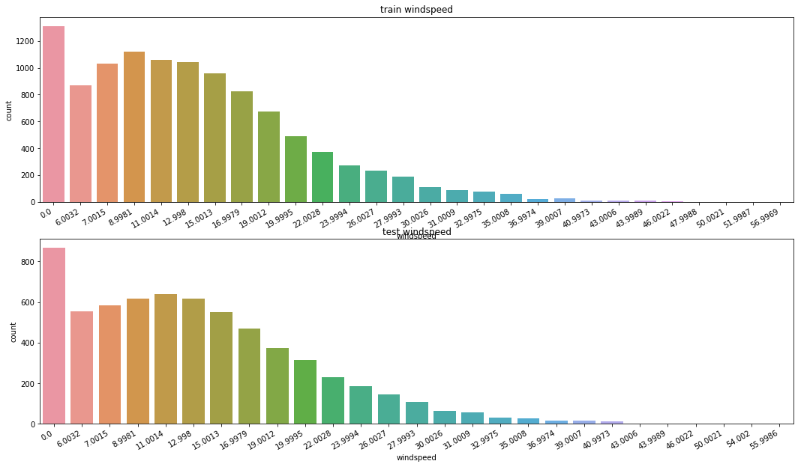
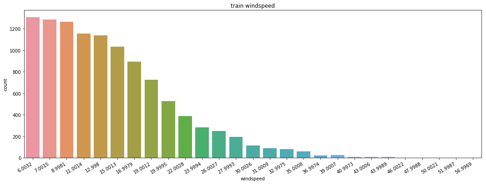
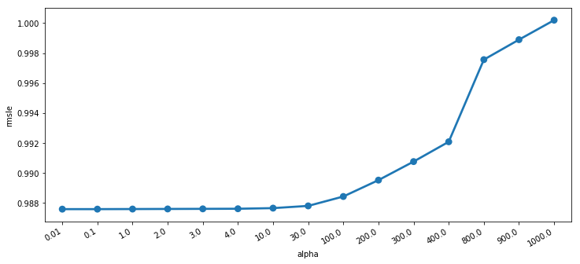
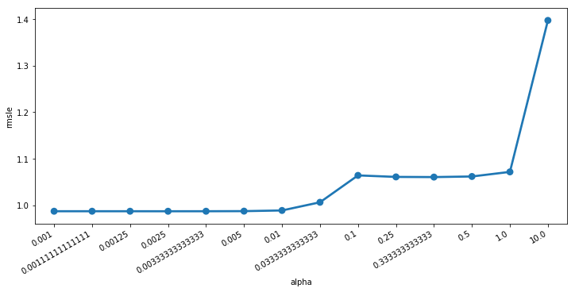
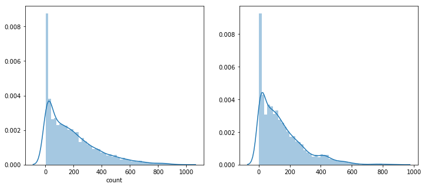
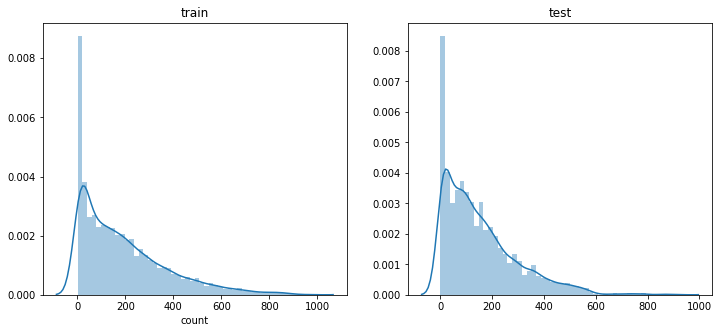

### Kaggle: EDA and simple ML modeling 

```python
import pandas as pd
import numpy as np

import matplotlib as mpl
import matplotlib.pyplot as plt
import seaborn as sns

%matplotlib inline

mpl.rcParams['axes.unicode_minus'] = False

import warnings
warnings.filterwarnings('ignore')
```

### Import data
```python
train = pd.read_csv('../DATA/train.csv', parse_dates=['datetime'])
train.shape
```


    (10886, 12)


```python
test = pd.read_csv('../DATA/test.csv',parse_dates=['datetime'])
test.shape
```


    (6493, 9)


```python
test.head()
```


<table border="1" class="dataframe">
  <thead>
    <tr style="text-align: right;">
      <th></th>
      <th>datetime</th>
      <th>season</th>
      <th>holiday</th>
      <th>workingday</th>
      <th>weather</th>
      <th>temp</th>
      <th>atemp</th>
      <th>humidity</th>
      <th>windspeed</th>
    </tr>
  </thead>
  <tbody>
    <tr>
      <th>0</th>
      <td>2011-01-20 00:00:00</td>
      <td>1</td>
      <td>0</td>
      <td>1</td>
      <td>1</td>
      <td>10.66</td>
      <td>11.365</td>
      <td>56</td>
      <td>26.0027</td>
    </tr>
    <tr>
      <th>1</th>
      <td>2011-01-20 01:00:00</td>
      <td>1</td>
      <td>0</td>
      <td>1</td>
      <td>1</td>
      <td>10.66</td>
      <td>13.635</td>
      <td>56</td>
      <td>0.0000</td>
    </tr>
    <tr>
      <th>2</th>
      <td>2011-01-20 02:00:00</td>
      <td>1</td>
      <td>0</td>
      <td>1</td>
      <td>1</td>
      <td>10.66</td>
      <td>13.635</td>
      <td>56</td>
      <td>0.0000</td>
    </tr>
    <tr>
      <th>3</th>
      <td>2011-01-20 03:00:00</td>
      <td>1</td>
      <td>0</td>
      <td>1</td>
      <td>1</td>
      <td>10.66</td>
      <td>12.880</td>
      <td>56</td>
      <td>11.0014</td>
    </tr>
    <tr>
      <th>4</th>
      <td>2011-01-20 04:00:00</td>
      <td>1</td>
      <td>0</td>
      <td>1</td>
      <td>1</td>
      <td>10.66</td>
      <td>12.880</td>
      <td>56</td>
      <td>11.0014</td>
    </tr>
  </tbody>
</table>
</div>


```python
train["year"] = train["datetime"].dt.year
train["month"] = train["datetime"].dt.month
train["hour"] = train["datetime"].dt.hour
train["dayofweek"] = train["datetime"].dt.dayofweek
train.shape
```


    (10886, 19)


```python
test["year"] = train["datetime"].dt.year
test["month"] = train["datetime"].dt.month
test["hour"] = train["datetime"].dt.hour
test["dayofweek"] = test["datetime"].dt.dayofweek
test.shape
```


    (6493, 16)


**Visualization**


```python
# windspeed : many zeros
fig, axes = plt.subplots(nrows=2)
fig.set_size_inches(18,10)

plt.sca(axes[0])
plt.xticks(rotation=30, ha='right')
axes[0].set(ylabel='Count', title="train windspeed")
sns.countplot(data=train, x="windspeed", ax=axes[0])

plt.sca(axes[1])
plt.xticks(rotation=30, ha='right')
axes[1].set(ylabel='count', title='test windspeed')
sns.countplot(data=test, x='windspeed', ax=axes[1])


```


    <matplotlib.axes._subplots.AxesSubplot at 0xdf0e630>





**speed zero -> Random Forest estimated value**
To Improve precision,


```python
# divide windspeed = 0 / others 

trainWind0 = train.loc[train['windspeed'] == 0]
trainWindNot0 = train.loc[train['windspeed'] != 0]
print(trainWind0.shape)
print(trainWindNot0.shape)
```

    (1313, 19)
    (9573, 19)


```python
from sklearn.ensemble import RandomForestClassifier

def predict_windspeed(data):
    
    # divide windspeed 0 or others
    dataWind0 = data.loc[data['windspeed'] == 0]
    dataWindNot0 = data.loc[data['windspeed'] != 0]
    
    # Feature selection to predict windspeed
    wCol = ["season", "weather", "humidity", "month", "temp", "year", "atemp"]

    # non-zero windspeed data converted to string
    dataWindNot0["windspeed"] = dataWindNot0["windspeed"].astype("str")

    # using Random 
    rfModel_wind = RandomForestClassifier()

    # wCol에 있는 피처의 값을 바탕으로 풍속을 학습시킨다
    rfModel_wind.fit(dataWindNot0[wCol], dataWindNot0['windspeed'])

    # 학습한 값을 바탕으로 풍속이 0으로 기록된 데이터의 풍속을 예측한다
    wind0Values = rfModel_wind.predict(X = dataWind0[wCol])

    # 값을 다 예측후 비교해보기 위해 
    # 예측한 갑을 넣어 줄 데이터 프레임을 새로 만든다
    predictWind0 = dataWind0
    predictWindNot0 = dataWindNot0
    
    # 값이 0으로 기록된 풍속에 대해 예측한 값을 넣어준다
    predictWind0['windspeed'] = wind0Values
    
    # dataWindNot0 0이 아닌 풍속이 있는 데이터프레임에 예측한 값이 있는 데이터프레임을 합쳐준다
    data = predictWindNot0.append(predictWind0)
    
    # 풍속의 데이터타입을 float으로 지정해준다
    data['windspeed'] = data['windspeed'].astype('float')
    
    data.reset_index(inplace=True)
    data.drop('index', inplace=True, axis=1)
    
    return data
```


```python
 train = predict_windspeed(train)
# test = predict_windspeed(test)

```


```python
fig, ax1 = plt.subplots()
fig.set_size_inches(18,6)

plt.sca(ax1)
plt.xticks(rotation=30, ha='right')
ax1.set(ylabel='count', title='train windspeed')
sns.countplot(data=train, x='windspeed', ax=ax1)
```


    <matplotlib.axes._subplots.AxesSubplot at 0xf366a58>





**Feature Selection**

- signal and noise separation
- increasing number of features not guarantee good performance


```python
# numeric feature와 categorical feature
# numeric feature = ['temp','humidity',windspeed','atemp']
# categorical feature type convert category
categorical_feature_names = ["season", "holiday", "workingday", "weather", "dayofweek", "month", "year", "hour"]

for var in categorical_feature_names:
    train[var] = train[var].astype('category')
    test[var] = test[var].astype('category')
    

feature_names = ["season", "weather", "temp", "atemp", "humidity", "windspeed",
                 "year", "hour", "dayofweek", "holiday", "workingday"]

### Selected feature names
```


    ['season',
     'weather',
     'temp',
     'atemp',
     'humidity',
     'windspeed',
     'year',
     'hour',
     'dayofweek',
     'holiday',
     'workingday']


```python
X_train = train[feature_names]

print(X_train.shape)
X_train.head()
```

    (10886, 11)


X_train
<table border="1" class="dataframe">
  <thead>
    <tr style="text-align: right;">
      <th></th>
      <th>season</th>
      <th>weather</th>
      <th>temp</th>
      <th>atemp</th>
      <th>humidity</th>
      <th>windspeed</th>
      <th>year</th>
      <th>hour</th>
      <th>dayofweek</th>
      <th>holiday</th>
      <th>workingday</th>
    </tr>
  </thead>
  <tbody>
    <tr>
      <th>0</th>
      <td>1</td>
      <td>1</td>
      <td>9.84</td>
      <td>14.395</td>
      <td>81</td>
      <td>0.0</td>
      <td>2011</td>
      <td>0</td>
      <td>5</td>
      <td>0</td>
      <td>0</td>
    </tr>
    <tr>
      <th>1</th>
      <td>1</td>
      <td>1</td>
      <td>9.02</td>
      <td>13.635</td>
      <td>80</td>
      <td>0.0</td>
      <td>2011</td>
      <td>1</td>
      <td>5</td>
      <td>0</td>
      <td>0</td>
    </tr>
    <tr>
      <th>2</th>
      <td>1</td>
      <td>1</td>
      <td>9.02</td>
      <td>13.635</td>
      <td>80</td>
      <td>0.0</td>
      <td>2011</td>
      <td>2</td>
      <td>5</td>
      <td>0</td>
      <td>0</td>
    </tr>
    <tr>
      <th>3</th>
      <td>1</td>
      <td>1</td>
      <td>9.84</td>
      <td>14.395</td>
      <td>75</td>
      <td>0.0</td>
      <td>2011</td>
      <td>3</td>
      <td>5</td>
      <td>0</td>
      <td>0</td>
    </tr>
    <tr>
      <th>4</th>
      <td>1</td>
      <td>1</td>
      <td>9.84</td>
      <td>14.395</td>
      <td>75</td>
      <td>0.0</td>
      <td>2011</td>
      <td>4</td>
      <td>5</td>
      <td>0</td>
      <td>0</td>
    </tr>
  </tbody>
</table>
</div>


```python
X_test = test[feature_names]

print(X_test.shape)
X_test.head()
```

    (6493, 11)


X_test
<table border="1" class="dataframe">
  <thead>
    <tr style="text-align: right;">
      <th></th>
      <th>season</th>
      <th>weather</th>
      <th>temp</th>
      <th>atemp</th>
      <th>humidity</th>
      <th>windspeed</th>
      <th>year</th>
      <th>hour</th>
      <th>dayofweek</th>
      <th>holiday</th>
      <th>workingday</th>
    </tr>
  </thead>
  <tbody>
    <tr>
      <th>0</th>
      <td>1</td>
      <td>1</td>
      <td>10.66</td>
      <td>11.365</td>
      <td>56</td>
      <td>26.0027</td>
      <td>2011</td>
      <td>0</td>
      <td>3</td>
      <td>0</td>
      <td>1</td>
    </tr>
    <tr>
      <th>1</th>
      <td>1</td>
      <td>1</td>
      <td>10.66</td>
      <td>13.635</td>
      <td>56</td>
      <td>0.0000</td>
      <td>2011</td>
      <td>1</td>
      <td>3</td>
      <td>0</td>
      <td>1</td>
    </tr>
    <tr>
      <th>2</th>
      <td>1</td>
      <td>1</td>
      <td>10.66</td>
      <td>13.635</td>
      <td>56</td>
      <td>0.0000</td>
      <td>2011</td>
      <td>2</td>
      <td>3</td>
      <td>0</td>
      <td>1</td>
    </tr>
    <tr>
      <th>3</th>
      <td>1</td>
      <td>1</td>
      <td>10.66</td>
      <td>12.880</td>
      <td>56</td>
      <td>11.0014</td>
      <td>2011</td>
      <td>3</td>
      <td>3</td>
      <td>0</td>
      <td>1</td>
    </tr>
    <tr>
      <th>4</th>
      <td>1</td>
      <td>1</td>
      <td>10.66</td>
      <td>12.880</td>
      <td>56</td>
      <td>11.0014</td>
      <td>2011</td>
      <td>4</td>
      <td>3</td>
      <td>0</td>
      <td>1</td>
    </tr>
  </tbody>
</table>
</div>


```python
label_name = "count"
y_train = train[label_name]

print(y_train.shape)
y_train.head()
```

    (10886L,)


    0    16
    1    40
    2    32
    3    13
    4     1
    Name: count, dtype: int64


### Metric

**RMSLE**

more penalty for under-estimation rather than over-estimation 


Error = root(mean(Square(x))) : should be smaller

high performance : close to 0 

Submissions are evaluated one the Root Mean Squared Logarithmic Error (RMSLE)

RMSLE cost function

```python
from sklearn.metrics import make_scorer

def rmsle(predicted_values, actual_values, convertExp=True):

    if convertExp:
        predicted_values = np.exp(predicted_values),
        actual_values = np.exp(actual_values)
        
    # numpy array
    predicted_values = np.array(predicted_values)
    actual_values = np.array(actual_values)
    
    # log(x +1) : avoid zero
    log_predict = np.log(predicted_values + 1)
    log_actual = np.log(actual_values + 1)
    
    # prediction - actual
    difference = log_predict - log_actual
    difference = np.square(difference)
    
    # average
    mean_difference = difference.mean()
    
    # root
    score = np.sqrt(mean_difference)
    
    return score
```

** Linear Regression Model **

```python
from sklearn.linear_model import LinearRegression, Ridge, Lasso
from sklearn.model_selection import GridSearchCV
from sklearn import metrics
import warnings
pd.options.mode.chained_assignment = None
warnings.filterwarnings("ignore", category=DeprecationWarning)

# initialization for linear regression model
lModel = LinearRegression()

# model training
y_train_log = np.log1p(y_train)
lModel.fit(X_train,y_train_log)

# predict and measure metric
preds = lModel.predict(X_train)
print ("RMLS Value Fro linear Regression: ",
       rmsle(np.exp(y_train_log),np.exp(preds), False))
```

    ('RMLS Value Fro linear Regression: ', 0.97965334462885068)


** Regularization Model - Ridge **

- linear model for regression
- weights converge to 0 then reduce the influence from features 
- Regularization to avoid overfitting
- max_iter = 3000


```python
ridge_m_ = Ridge()
ridge_params_ = { 'max_iter':[3000], 'alpha':[0.01, 0.1, 1, 2, 3, 4, 10, 30,100,200,300,400,800,900,1000]}
rmsle_scorer = metrics.make_scorer(rmsle, greater_is_better=False)
grid_ridge_m = GridSearchCV(ridge_m_,
                           ridge_params_,
                            scoring = rmsle_scorer,
                            cv=5)
y_train_log = np.log1p(y_train)
grid_ridge_m.fit( X_train, y_train_log)
preds = grid_ridge_m.predict(X_train)
print(grid_ridge_m.best_params_)
print("RMSLE Value For Ridge Regression: ", rmsle(np.exp(y_train_log),np.exp(preds), False))

fig,ax = plt.subplots()
fig.set_size_inches(12,5)
df = pd.DataFrame(grid_ridge_m.grid_scores_)
df["alpha"] = df["parameters"].apply(lambda x:x["alpha"])
df["rmsle"] = df["mean_validation_score"].apply(lambda x:-x)

plt.xticks(rotation=30, ha='right')
sns.pointplot(data=df, x='alpha',y='rmsle',ax=ax)


```

    {'alpha': 0.01, 'max_iter': 3000}
    ('RMSLE Value For Ridge Regression: ', 0.97965334261690595)


    <matplotlib.axes._subplots.AxesSubplot at 0x108c49e8>





** Regularization Model - Lasso **

- linear regression = Regularization
- not important features are zero weight
- auto feature selection
- reduce alpha to avoide underfitting (e.g.: alpha for grid search = 0.0025)


```python
lasso_m_ = Lasso()

alpha  = 1/np.array([0.1, 1, 2, 3, 4, 10, 30,100,200,300,400,800,900,1000])
lasso_params_ = { 'max_iter':[3000],'alpha':alpha}

grid_lasso_m = GridSearchCV( lasso_m_,lasso_params_,scoring = rmsle_scorer,cv=5)
y_train_log = np.log1p(y_train)
grid_lasso_m.fit( X_train , y_train_log )
preds = grid_lasso_m.predict(X_train)
print (grid_lasso_m.best_params_)
print ("RMSLE Value For Lasso Regression: ",rmsle(np.exp(y_train_log),np.exp(preds),False))

fig,ax= plt.subplots()
fig.set_size_inches(12,5)
df = pd.DataFrame(grid_lasso_m.grid_scores_)
df["alpha"] = df["parameters"].apply(lambda x:x["alpha"])
df["rmsle"] = df["mean_validation_score"].apply(lambda x:-x)

plt.xticks(rotation=30, ha='right')
sns.pointplot(data=df,x="alpha",y="rmsle",ax=ax)
```

    {'alpha': 0.0025000000000000001, 'max_iter': 3000}
    ('RMSLE Value For Lasso Regression: ', 0.97966915379763486)


    <matplotlib.axes._subplots.AxesSubplot at 0x1003f048>





 

 ** Ensemble Models - Random Forest **

 


```python
from sklearn.ensemble import RandomForestRegressor
rfModel = RandomForestRegressor(n_estimators=100)

y_train_log = np.log1p(y_train)
rfModel.fit(X_train, y_train_log)

preds = rfModel.predict(X_train)
score = rmsle(np.exp(y_train_log), np.exp(preds), False)
print("RMSLE value for Random Forest: ",score)

```

    ('RMSLE value for Random Forest: ', 0.10595027919581249)


** Ensemble Model - Gradient Boost **


```python
from sklearn.ensemble import GradientBoostingRegressor
gbm = GradientBoostingRegressor(n_estimators=4000, alpha=0.01)

y_train_log = np.log1p(y_train)
gbm.fit(X_train, y_train_log)

preds = gbm.predict(X_train)
score = rmsle(np.exp(y_train_log),np.exp(preds),False)
print("RMSLE Value for Graidient Boost: ", score)
```

    ('RMSLE Value for Graidient Boost: ', 0.20417262910493975)


```python
#predsTest = rfModel.predict(X_test)
predsTest = gbm.predict(X_test)
fig, (ax1, ax2) = plt.subplots(ncols=2)
fig.set_size_inches(12,5)
sns.distplot(y_train, ax=ax1, bins=50)
sns.distplot(np.exp(predsTest), ax=ax2, bins=50)
```


    <matplotlib.axes._subplots.AxesSubplot at 0x17ad9710>





** Submit **


```python
submission = pd.read_csv('../DATA/sampleSubmission.csv')
submission

submission["count"] = np.exp(predsTest)

print(submission.shape)
submission.head()
```

    (6493, 2)


<div>
<style>
    .dataframe thead tr:only-child th {
        text-align: right;
    }

    .dataframe thead th {
        text-align: left;
    }
    
    .dataframe tbody tr th {
        vertical-align: top;
    }
</style>
<table border="1" class="dataframe">
  <thead>
    <tr style="text-align: right;">
      <th></th>
      <th>datetime</th>
      <th>count</th>
    </tr>
  </thead>
  <tbody>
    <tr>
      <th>0</th>
      <td>2011-01-20 00:00:00</td>
      <td>12.449856</td>
    </tr>
    <tr>
      <th>1</th>
      <td>2011-01-20 01:00:00</td>
      <td>5.658840</td>
    </tr>
    <tr>
      <th>2</th>
      <td>2011-01-20 02:00:00</td>
      <td>3.825400</td>
    </tr>
    <tr>
      <th>3</th>
      <td>2011-01-20 03:00:00</td>
      <td>2.586785</td>
    </tr>
    <tr>
      <th>4</th>
      <td>2011-01-20 04:00:00</td>
      <td>2.281436</td>
    </tr>
  </tbody>
</table>
</div>


```python
submission.to_csv('../DATA/Score_{0:.5f}_submission.csv'.format(score),index=False)
```


```python

from sklearn.model_selection import KFold
from sklearn.model_selection import cross_val_score

k_fold = KFold(n_splits=10, shuffle=True, random_state=0)
```


```python
from sklearn.ensemble import RandomForestRegressor

max_depth_list = []

model = RandomForestRegressor(n_estimators=100,
                              n_jobs=-1,
                              random_state=0)
model
```


    RandomForestRegressor(bootstrap=True, criterion='mse', max_depth=None,
               max_features='auto', max_leaf_nodes=None,
               min_impurity_decrease=0.0, min_impurity_split=None,
               min_samples_leaf=1, min_samples_split=2,
               min_weight_fraction_leaf=0.0, n_estimators=100, n_jobs=-1,
               oob_score=False, random_state=0, verbose=0, warm_start=False)


```python
%time score = cross_val_score(model, X_train, y_train, cv=k_fold, scoring=rmsle_scorer)
score = score.mean()
# 0에 근접할수록 좋은 데이터
print("Score= {0:.5f}".format(score))
```

    Wall time: 17.9 s
    Score= 0.33063


### Training
```python

model.fit(X_train, y_train)
```


    RandomForestRegressor(bootstrap=True, criterion='mse', max_depth=None,
               max_features='auto', max_leaf_nodes=None,
               min_impurity_decrease=0.0, min_impurity_split=None,
               min_samples_leaf=1, min_samples_split=2,
               min_weight_fraction_leaf=0.0, n_estimators=100, n_jobs=-1,
               oob_score=False, random_state=0, verbose=0, warm_start=False)


### Prediction
```python

predictions = model.predict(X_test)

print(predictions.shape)
predictions[0:10]
```

    (6493L,)


    array([  12.68,    5.02,    4.11,    3.6 ,    3.19,    6.33,   38.23,
            105.43,  233.31,  136.18])


### Visualization
```python

fig,(ax1,ax2)= plt.subplots(ncols=2)
fig.set_size_inches(12,5)
sns.distplot(y_train,ax=ax1,bins=50)
ax1.set(title="train")
sns.distplot(predictions,ax=ax2,bins=50)
ax2.set(title="test")
```


    [<matplotlib.text.Text at 0x14e2cd30>]





```python
submission = pd.read_csv("../DATA/sampleSubmission.csv")
submission

submission["count"] = predictions

print(submission.shape)
submission.head()
```

    (6493, 2)


<div>
<style>
    .dataframe thead tr:only-child th {
        text-align: right;
    }

    .dataframe thead th {
        text-align: left;
    }
    
    .dataframe tbody tr th {
        vertical-align: top;
    }
</style>
<table border="1" class="dataframe">
  <thead>
    <tr style="text-align: right;">
      <th></th>
      <th>datetime</th>
      <th>count</th>
    </tr>
  </thead>
  <tbody>
    <tr>
      <th>0</th>
      <td>2011-01-20 00:00:00</td>
      <td>12.68</td>
    </tr>
    <tr>
      <th>1</th>
      <td>2011-01-20 01:00:00</td>
      <td>5.02</td>
    </tr>
    <tr>
      <th>2</th>
      <td>2011-01-20 02:00:00</td>
      <td>4.11</td>
    </tr>
    <tr>
      <th>3</th>
      <td>2011-01-20 03:00:00</td>
      <td>3.60</td>
    </tr>
    <tr>
      <th>4</th>
      <td>2011-01-20 04:00:00</td>
      <td>3.19</td>
    </tr>
  </tbody>
</table>
</div>


```python
submission.to_csv("../DATA/Score_{0:.5f}_submission.csv".format(score), index=False)
```

