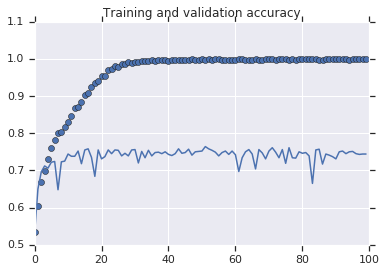

#### Coursera course project using CNN(Convolutional Neural Network)

```python

# Using more sophisticated images with Convolutional Neural Networks

In the previous lesson you saw how to use a CNN to make your recognition of the handwriting digits more efficient. In this lesson you'll take that to the next level, recognizing real images of Cats and Dogs in order to classify an incoming image as one or the other. In particular the handwriting recognition made your life a little easier by having all the images be the same size and shape, and they were all monochrome color. Real-world images aren't like that  they're in different shapes, aspect ratios etc, and they're usually in color!

So, as part of the task you need to process your data -- not least resizing it to be uniform in shape. 

You'll follow these steps:

1.   Explore the Example Data of Cats and Dogs
2.   Build and Train a Neural Network to recognize the difference between the two
3.   Evaluate the Training and Validation accuracy

## Explore the Example Data

Let's start by downloading our example data, a .zip of 2,000 JPG pictures of cats and dogs, and extracting it locally in `/tmp`.

**NOTE:** The 2,000 images used in this exercise are excerpted from the ["Dogs vs. Cats" dataset](https://www.kaggle.com/c/dogs-vs-cats/data) available on Kaggle, which contains 25,000 images. Here, we use a subset of the full dataset to decrease training time for educational purposes.


```python
!wget --no-check-certificate \
  https://storage.googleapis.com/mledu-datasets/cats_and_dogs_filtered.zip \
  -O /tmp/cats_and_dogs_filtered.zip
```

    --2019-02-19 15:15:07--  https://storage.googleapis.com/mledu-datasets/cats_and_dogs_filtered.zip
    Resolving storage.googleapis.com (storage.googleapis.com)... 74.125.141.128, 2607:f8b0:400c:c06::80
    Connecting to storage.googleapis.com (storage.googleapis.com)|74.125.141.128|:443... connected.
    HTTP request sent, awaiting response... 200 OK
    Length: 68606236 (65M) [application/zip]
    Saving to: ‘/tmp/cats_and_dogs_filtered.zip’
    
    /tmp/cats_and_dogs_ 100%[===================>]  65.43M  49.7MB/s    in 1.3s    
    
    2019-02-19 15:15:09 (49.7 MB/s) - ‘/tmp/cats_and_dogs_filtered.zip’ saved [68606236/68606236]
    
    

The following python code will use the OS library to use Operating System libraries, giving you access to the file system, and the zipfile library allowing you to unzip the data. 


```python
import os
import zipfile

local_zip = '/tmp/cats_and_dogs_filtered.zip'

zip_ref = zipfile.ZipFile(local_zip, 'r')

zip_ref.extractall('/tmp')
zip_ref.close()
```

The contents of the .zip are extracted to the base directory `/tmp/cats_and_dogs_filtered`, which contains `train` and `validation` subdirectories for the training and validation datasets (see the [Machine Learning Crash Course](https://developers.google.com/machine-learning/crash-course/validation/check-your-intuition) for a refresher on training, validation, and test sets), which in turn each contain `cats` and `dogs` subdirectories.

In short: The training set is the data that is used to tell the neural network model that 'this is what a cat looks like', 'this is what a dog looks like' etc. The validation data set is images of cats and dogs that the neural network will not see as part of the training, so you can test how well or how badly it does in evaluating if an image contains a cat or a dog.

One thing to pay attention to in this sample: We do not explicitly label the images as cats or dogs. If you remember with the handwriting example earlier, we had labelled 'this is a 1', 'this is a 7' etc.  Later you'll see something called an ImageGenerator being used -- and this is coded to read images from subdirectories, and automatically label them from the name of that subdirectory. So, for example, you will have a 'training' directory containing a 'cats' directory and a 'dogs' one. ImageGenerator will label the images appropriately for you, reducing a coding step. 

Let's define each of these directories:


```python
base_dir = '/tmp/cats_and_dogs_filtered'

train_dir = os.path.join(base_dir, 'train')
validation_dir = os.path.join(base_dir, 'validation')

# Directory with our training cat/dog pictures
train_cats_dir = os.path.join(train_dir, 'cats')
train_dogs_dir = os.path.join(train_dir, 'dogs')

# Directory with our validation cat/dog pictures
validation_cats_dir = os.path.join(validation_dir, 'cats')
validation_dogs_dir = os.path.join(validation_dir, 'dogs')

```

Now, let's see what the filenames look like in the `cats` and `dogs` `train` directories (file naming conventions are the same in the `validation` directory):


```python
train_cat_fnames = os.listdir( train_cats_dir )
train_dog_fnames = os.listdir( train_dogs_dir )

print(train_cat_fnames[:10])
print(train_dog_fnames[:10])
```

    ['cat.829.jpg', 'cat.189.jpg', 'cat.432.jpg', 'cat.647.jpg', 'cat.295.jpg', 'cat.496.jpg', 'cat.974.jpg', 'cat.301.jpg', 'cat.608.jpg', 'cat.946.jpg']
    ['dog.160.jpg', 'dog.216.jpg', 'dog.848.jpg', 'dog.99.jpg', 'dog.936.jpg', 'dog.67.jpg', 'dog.995.jpg', 'dog.634.jpg', 'dog.461.jpg', 'dog.791.jpg']
    

Let's find out the total number of cat and dog images in the `train` and `validation` directories:


```python
print('total training cat images :', len(os.listdir(      train_cats_dir ) ))
print('total training dog images :', len(os.listdir(      train_dogs_dir ) ))

print('total validation cat images :', len(os.listdir( validation_cats_dir ) ))
print('total validation dog images :', len(os.listdir( validation_dogs_dir ) ))
```

    total training cat images : 1000
    total training dog images : 1000
    total validation cat images : 500
    total validation dog images : 500
    

For both cats and dogs, we have 1,000 training images and 500 validation images.

Now let's take a look at a few pictures to get a better sense of what the cat and dog datasets look like. First, configure the matplot parameters:


```python
%matplotlib inline

import matplotlib.image as mpimg
import matplotlib.pyplot as plt

# Parameters for our graph; we'll output images in a 4x4 configuration
nrows = 4
ncols = 4

pic_index = 0 # Index for iterating over images
```

Now, display a batch of 8 cat and 8 dog pictures. You can rerun the cell to see a fresh batch each time:


```python
# Set up matplotlib fig, and size it to fit 4x4 pics
fig = plt.gcf()
fig.set_size_inches(ncols*4, nrows*4)

pic_index+=8

next_cat_pix = [os.path.join(train_cats_dir, fname) 
                for fname in train_cat_fnames[ pic_index-8:pic_index] 
               ]

next_dog_pix = [os.path.join(train_dogs_dir, fname) 
                for fname in train_dog_fnames[ pic_index-8:pic_index]
               ]

for i, img_path in enumerate(next_cat_pix+next_dog_pix):
  # Set up subplot; subplot indices start at 1
  sp = plt.subplot(nrows, ncols, i + 1)
  sp.axis('Off') # Don't show axes (or gridlines)

  img = mpimg.imread(img_path)
  plt.imshow(img)

plt.show()

```


It may not be obvious from looking at the images in this grid, but an important note here, and a significant difference from the previous lesson is that these images come in all shapes and sizes. When you did the handwriting recognition example, you had 28x28 greyscale images to work with. These are color and in a variety of shapes. Before training a Neural network with them you'll need to tweak the images. You'll see that in the next section.

Ok, now that you have an idea for what your data looks like, the next step is to define the model that will be trained to recognize cats or dogs from these images 

## Building a Small Model from Scratch to Get to ~72% Accuracy

In the previous section you saw that the images were in a variety of shapes and sizes. In order to train a neural network to handle them you'll need them to be in a uniform size. We've chosen 150x150 for this, and you'll see the code that preprocesses the images to that shape shortly. 

But before we continue, let's start defining the model:

Step 1 will be to import tensorflow.


```python
import tensorflow as tf
```

Next we will define a Sequential layer as before, adding some convolutional layers first. Note the input shape parameter this time. In the earlier example it was 28x28x1, because the image was 28x28 in greyscale (8 bits, 1 byte for color depth). This time it is 150x150 for the size and 3 (24 bits, 3 bytes) for the color depth. 


We then add a couple of convolutional layers as in the previous example, and flatten the final result to feed into the densely connected layers.

Finally we add the densely connected layers. 

Note that because we are facing a two-class classification problem, i.e. a *binary classification problem*, we will end our network with a [*sigmoid* activation](https://wikipedia.org/wiki/Sigmoid_function), so that the output of our network will be a single scalar between 0 and 1, encoding the probability that the current image is class 1 (as opposed to class 0).


```python
model = tf.keras.models.Sequential([
    # Note the input shape is the desired size of the image 150x150 with 3 bytes color
    tf.keras.layers.Conv2D(16, (3,3), activation='relu', input_shape=(150, 150, 3)),
    tf.keras.layers.MaxPooling2D(2,2),
    tf.keras.layers.Conv2D(32, (3,3), activation='relu'),
    tf.keras.layers.MaxPooling2D(2,2), 
    tf.keras.layers.Conv2D(64, (3,3), activation='relu'), 
    tf.keras.layers.MaxPooling2D(2,2),
    # Flatten the results to feed into a DNN
    tf.keras.layers.Flatten(), 
    # 512 neuron hidden layer
    tf.keras.layers.Dense(512, activation='relu'), 
    # Only 1 output neuron. It will contain a value from 0-1 where 0 for 1 class ('cats') and 1 for the other ('dogs')
    tf.keras.layers.Dense(1, activation='sigmoid')  
])
```

The model.summary() method call prints a summary of the NN 


```python
model.summary()
```

The "output shape" column shows how the size of your feature map evolves in each successive layer. The convolution layers reduce the size of the feature maps by a bit due to padding, and each pooling layer halves the dimensions.

Next, we'll configure the specifications for model training. We will train our model with the `binary_crossentropy` loss, because it's a binary classification problem and our final activation is a sigmoid. (For a refresher on loss metrics, see the [Machine Learning Crash Course](https://developers.google.com/machine-learning/crash-course/descending-into-ml/video-lecture).) We will use the `rmsprop` optimizer with a learning rate of `0.001`. During training, we will want to monitor classification accuracy.

**NOTE**: In this case, using the [RMSprop optimization algorithm](https://wikipedia.org/wiki/Stochastic_gradient_descent#RMSProp) is preferable to [stochastic gradient descent](https://developers.google.com/machine-learning/glossary/#SGD) (SGD), because RMSprop automates learning-rate tuning for us. (Other optimizers, such as [Adam](https://wikipedia.org/wiki/Stochastic_gradient_descent#Adam) and [Adagrad](https://developers.google.com/machine-learning/glossary/#AdaGrad), also automatically adapt the learning rate during training, and would work equally well here.)


```python
from tensorflow.keras.optimizers import RMSprop

model.compile(optimizer=RMSprop(lr=0.001),
              loss='binary_crossentropy',
              metrics = ['acc'])
```

### Data Preprocessing

Let's set up data generators that will read pictures in our source folders, convert them to `float32` tensors, and feed them (with their labels) to our network. We'll have one generator for the training images and one for the validation images. Our generators will yield batches of 20 images of size 150x150 and their labels (binary).

As you may already know, data that goes into neural networks should usually be normalized in some way to make it more amenable to processing by the network. (It is uncommon to feed raw pixels into a convnet.) In our case, we will preprocess our images by normalizing the pixel values to be in the `[0, 1]` range (originally all values are in the `[0, 255]` range).

In Keras this can be done via the `keras.preprocessing.image.ImageDataGenerator` class using the `rescale` parameter. This `ImageDataGenerator` class allows you to instantiate generators of augmented image batches (and their labels) via `.flow(data, labels)` or `.flow_from_directory(directory)`. These generators can then be used with the Keras model methods that accept data generators as inputs: `fit_generator`, `evaluate_generator`, and `predict_generator`.


```python
from tensorflow.keras.preprocessing.image import ImageDataGenerator

# All images will be rescaled by 1./255.
train_datagen = ImageDataGenerator( rescale = 1.0/255. )
test_datagen  = ImageDataGenerator( rescale = 1.0/255. )

# --------------------
# Flow training images in batches of 20 using train_datagen generator
# --------------------
train_generator = train_datagen.flow_from_directory(train_dir,
                                                    batch_size=20,
                                                    class_mode='binary',
                                                    target_size=(150, 150))     
# --------------------
# Flow validation images in batches of 20 using test_datagen generator
# --------------------
validation_generator =  test_datagen.flow_from_directory(validation_dir,
                                                         batch_size=20,
                                                         class_mode  = 'binary',
                                                         target_size = (150, 150))

```

### Training
Let's train on all 2,000 images available, for 15 epochs, and validate on all 1,000 test images. (This may take a few minutes to run.)

Do note the values per epoch.

You'll see 4 values per epoch -- Loss, Accuracy, Validation Loss and Validation Accuracy. 

The Loss and Accuracy are a great indication of progress of training. It's making a guess as to the classification of the training data, and then measuring it against the known label, calculating the result. Accuracy is the portion of correct guesses. The Validation accuracy is the measurement with the data that has not been used in training. As expected this would be a bit lower. You'll learn about why this occurs in the section on overfitting later in this course.


```python
history = model.fit_generator(train_generator,
                              validation_data=validation_generator,
                              steps_per_epoch=100,
                              epochs=15,
                              validation_steps=50,
                              verbose=2)
```

###Running the Model

Let's now take a look at actually running a prediction using the model. This code will allow you to choose 1 or more files from your file system, it will then upload them, and run them through the model, giving an indication of whether the object is a dog or a cat.


```python
import numpy as np

from google.colab import files
from keras.preprocessing import image

uploaded=files.upload()

for fn in uploaded.keys():
 
  # predicting images
  path='/content/' + fn
  img=image.load_img(path, target_size=(150, 150))
  
  x=image.img_to_array(img)
  x=np.expand_dims(x, axis=0)
  images = np.vstack([x])
  
  classes = model.predict(images, batch_size=10)
  
  print(classes[0])
  
  if classes[0]>0:
    print(fn + " is a dog")
    
  else:
    print(fn + " is a cat")
 
```

### Visualizing Intermediate Representations

To get a feel for what kind of features our convnet has learned, one fun thing to do is to visualize how an input gets transformed as it goes through the convnet.

Let's pick a random cat or dog image from the training set, and then generate a figure where each row is the output of a layer, and each image in the row is a specific filter in that output feature map. Rerun this cell to generate intermediate representations for a variety of training images.


```python
import numpy as np
import random
from   tensorflow.keras.preprocessing.image import img_to_array, load_img

# Let's define a new Model that will take an image as input, and will output
# intermediate representations for all layers in the previous model after
# the first.
successive_outputs = [layer.output for layer in model.layers[1:]]

#visualization_model = Model(img_input, successive_outputs)
visualization_model = tf.keras.models.Model(inputs = model.input, outputs = successive_outputs)

# Let's prepare a random input image of a cat or dog from the training set.
cat_img_files = [os.path.join(train_cats_dir, f) for f in train_cat_fnames]
dog_img_files = [os.path.join(train_dogs_dir, f) for f in train_dog_fnames]

img_path = random.choice(cat_img_files + dog_img_files)
img = load_img(img_path, target_size=(150, 150))  # this is a PIL image

x   = img_to_array(img)                           # Numpy array with shape (150, 150, 3)
x   = x.reshape((1,) + x.shape)                   # Numpy array with shape (1, 150, 150, 3)

# Rescale by 1/255
x /= 255.0

# Let's run our image through our network, thus obtaining all
# intermediate representations for this image.
successive_feature_maps = visualization_model.predict(x)

# These are the names of the layers, so can have them as part of our plot
layer_names = [layer.name for layer in model.layers]

# -----------------------------------------------------------------------
# Now let's display our representations
# -----------------------------------------------------------------------
for layer_name, feature_map in zip(layer_names, successive_feature_maps):
  
  if len(feature_map.shape) == 4:
    
    #-------------------------------------------
    # Just do this for the conv / maxpool layers, not the fully-connected layers
    #-------------------------------------------
    n_features = feature_map.shape[-1]  # number of features in the feature map
    size       = feature_map.shape[ 1]  # feature map shape (1, size, size, n_features)
    
    # We will tile our images in this matrix
    display_grid = np.zeros((size, size * n_features))
    
    #-------------------------------------------------
    # Postprocess the feature to be visually palatable
    #-------------------------------------------------
    for i in range(n_features):
      x  = feature_map[0, :, :, i]
      x -= x.mean()
      x /= x.std ()
      x *=  64
      x += 128
      x  = np.clip(x, 0, 255).astype('uint8')
      display_grid[:, i * size : (i + 1) * size] = x # Tile each filter into a horizontal grid

    #-----------------
    # Display the grid
    #-----------------

    scale = 20. / n_features
    plt.figure( figsize=(scale * n_features, scale) )
    plt.title ( layer_name )
    plt.grid  ( False )
    plt.imshow( display_grid, aspect='auto', cmap='viridis' ) 
```

As you can see we go from the raw pixels of the images to increasingly abstract and compact representations. The representations downstream start highlighting what the network pays attention to, and they show fewer and fewer features being "activated"; most are set to zero. This is called "sparsity." Representation sparsity is a key feature of deep learning.


These representations carry increasingly less information about the original pixels of the image, but increasingly refined information about the class of the image. You can think of a convnet (or a deep network in general) as an information distillation pipeline.

### Evaluating Accuracy and Loss for the Model

Let's plot the training/validation accuracy and loss as collected during training:


```python
#-----------------------------------------------------------
# Retrieve a list of list results on training and test data
# sets for each training epoch
#-----------------------------------------------------------
acc      = history.history[     'acc' ]
val_acc  = history.history[ 'val_acc' ]
loss     = history.history[    'loss' ]
val_loss = history.history['val_loss' ]

epochs   = range(len(acc)) # Get number of epochs

#------------------------------------------------
# Plot training and validation accuracy per epoch
#------------------------------------------------
plt.plot  ( epochs,     acc )
plt.plot  ( epochs, val_acc )
plt.title ('Training and validation accuracy')
plt.figure()

#------------------------------------------------
# Plot training and validation loss per epoch
#------------------------------------------------
plt.plot  ( epochs,     loss )
plt.plot  ( epochs, val_loss )
plt.title ('Training and validation loss'   )
```

As you can see, we are **overfitting** like it's getting out of fashion. Our training accuracy (in blue) gets close to 100% (!) while our validation accuracy (in green) stalls as 70%. Our validation loss reaches its minimum after only five epochs.

Since we have a relatively small number of training examples (2000), overfitting should be our number one concern. Overfitting happens when a model exposed to too few examples learns patterns that do not generalize to new data, i.e. when the model starts using irrelevant features for making predictions. For instance, if you, as a human, only see three images of people who are lumberjacks, and three images of people who are sailors, and among them the only person wearing a cap is a lumberjack, you might start thinking that wearing a cap is a sign of being a lumberjack as opposed to a sailor. You would then make a pretty lousy lumberjack/sailor classifier.

Overfitting is the central problem in machine learning: given that we are fitting the parameters of our model to a given dataset, how can we make sure that the representations learned by the model will be applicable to data never seen before? How do we avoid learning things that are specific to the training data?

In the next exercise, we'll look at ways to prevent overfitting in the cat vs. dog classification model.

## Clean Up

Before running the next exercise, run the following cell to terminate the kernel and free memory resources:


```python
import os, signal

os.kill(     os.getpid() , 
         signal.SIGKILL
       )
```


```python
!wget --no-check-certificate \
    https://storage.googleapis.com/mledu-datasets/cats_and_dogs_filtered.zip \
    -O /tmp/cats_and_dogs_filtered.zip
  
import os
import zipfile
import tensorflow as tf
from tensorflow.keras.optimizers import RMSprop
from tensorflow.keras.preprocessing.image import ImageDataGenerator

local_zip = '/tmp/cats_and_dogs_filtered.zip'
zip_ref = zipfile.ZipFile(local_zip, 'r')
zip_ref.extractall('/tmp')
zip_ref.close()

base_dir = '/tmp/cats_and_dogs_filtered'
train_dir = os.path.join(base_dir, 'train')
validation_dir = os.path.join(base_dir, 'validation')

# Directory with our training cat pictures
train_cats_dir = os.path.join(train_dir, 'cats')

# Directory with our training dog pictures
train_dogs_dir = os.path.join(train_dir, 'dogs')

# Directory with our validation cat pictures
validation_cats_dir = os.path.join(validation_dir, 'cats')

# Directory with our validation dog pictures
validation_dogs_dir = os.path.join(validation_dir, 'dogs')

model = tf.keras.models.Sequential([
    tf.keras.layers.Conv2D(32, (3,3), activation='relu', input_shape=(150, 150, 3)),
    tf.keras.layers.MaxPooling2D(2, 2),
    tf.keras.layers.Conv2D(64, (3,3), activation='relu'),
    tf.keras.layers.MaxPooling2D(2,2),
    tf.keras.layers.Conv2D(128, (3,3), activation='relu'),
    tf.keras.layers.MaxPooling2D(2,2),
    tf.keras.layers.Conv2D(128, (3,3), activation='relu'),
    tf.keras.layers.MaxPooling2D(2,2),
    tf.keras.layers.Flatten(),
    tf.keras.layers.Dense(512, activation='relu'),
    tf.keras.layers.Dense(1, activation='sigmoid')
])

model.compile(loss='binary_crossentropy',
              optimizer=RMSprop(lr=1e-4),
              metrics=['acc'])

# All images will be rescaled by 1./255
train_datagen = ImageDataGenerator(rescale=1./255)
test_datagen = ImageDataGenerator(rescale=1./255)

# Flow training images in batches of 20 using train_datagen generator
train_generator = train_datagen.flow_from_directory(
        train_dir,  # This is the source directory for training images
        target_size=(150, 150),  # All images will be resized to 150x150
        batch_size=20,
        # Since we use binary_crossentropy loss, we need binary labels
        class_mode='binary')

# Flow validation images in batches of 20 using test_datagen generator
validation_generator = test_datagen.flow_from_directory(
        validation_dir,
        target_size=(150, 150),
        batch_size=20,
        class_mode='binary')

history = model.fit_generator(
      train_generator,
      steps_per_epoch=100,  # 2000 images = batch_size * steps
      epochs=100,
      validation_data=validation_generator,
      validation_steps=50,  # 1000 images = batch_size * steps
      verbose=2)


```

    --2019-05-17 04:39:05--  https://storage.googleapis.com/mledu-datasets/cats_and_dogs_filtered.zip
    Resolving storage.googleapis.com (storage.googleapis.com)... 108.177.112.128, 2607:f8b0:4001:c07::80
    Connecting to storage.googleapis.com (storage.googleapis.com)|108.177.112.128|:443... connected.
    HTTP request sent, awaiting response... 200 OK
    Length: 68606236 (65M) [application/zip]
    Saving to: ‘/tmp/cats_and_dogs_filtered.zip’
    
    /tmp/cats_and_dogs_ 100%[===================>]  65.43M   211MB/s    in 0.3s    
    
    2019-05-17 04:39:11 (211 MB/s) - ‘/tmp/cats_and_dogs_filtered.zip’ saved [68606236/68606236]
    
    WARNING:tensorflow:From /usr/local/lib/python3.6/dist-packages/tensorflow/python/ops/resource_variable_ops.py:435: colocate_with (from tensorflow.python.framework.ops) is deprecated and will be removed in a future version.
    Instructions for updating:
    Colocations handled automatically by placer.
    Found 2000 images belonging to 2 classes.
    Found 1000 images belonging to 2 classes.
    WARNING:tensorflow:From /usr/local/lib/python3.6/dist-packages/tensorflow/python/ops/math_ops.py:3066: to_int32 (from tensorflow.python.ops.math_ops) is deprecated and will be removed in a future version.
    Instructions for updating:
    Use tf.cast instead.
    Epoch 1/100
    50/50 [==============================] - 3s 66ms/step - loss: 0.6820 - acc: 0.5330
     - 14s - loss: 0.6888 - acc: 0.5375 - val_loss: 0.6820 - val_acc: 0.5330
    Epoch 2/100
    50/50 [==============================] - 3s 66ms/step - loss: 0.6319 - acc: 0.6640
     - 9s - loss: 0.6529 - acc: 0.6055 - val_loss: 0.6319 - val_acc: 0.6640
    Epoch 3/100
    50/50 [==============================] - 3s 66ms/step - loss: 0.6131 - acc: 0.6670
     - 9s - loss: 0.5995 - acc: 0.6830 - val_loss: 0.6131 - val_acc: 0.6670
    Epoch 4/100
    50/50 [==============================] - 4s 75ms/step - loss: 0.5765 - acc: 0.7070
     - 9s - loss: 0.5708 - acc: 0.6885 - val_loss: 0.5765 - val_acc: 0.7070
    Epoch 5/100
    50/50 [==============================] - 3s 66ms/step - loss: 0.5667 - acc: 0.7020
     - 9s - loss: 0.5405 - acc: 0.7225 - val_loss: 0.5667 - val_acc: 0.7020
    Epoch 6/100
    50/50 [==============================] - 3s 66ms/step - loss: 0.5506 - acc: 0.7220
     - 9s - loss: 0.5082 - acc: 0.7490 - val_loss: 0.5506 - val_acc: 0.7220
    Epoch 7/100
    50/50 [==============================] - 3s 65ms/step - loss: 0.5711 - acc: 0.7100
     - 9s - loss: 0.4917 - acc: 0.7615 - val_loss: 0.5711 - val_acc: 0.7100
    Epoch 8/100
    50/50 [==============================] - 3s 65ms/step - loss: 0.5364 - acc: 0.7280
     - 9s - loss: 0.4710 - acc: 0.7800 - val_loss: 0.5364 - val_acc: 0.7280
    Epoch 9/100
    50/50 [==============================] - 3s 66ms/step - loss: 0.5272 - acc: 0.7440
     - 9s - loss: 0.4449 - acc: 0.7865 - val_loss: 0.5272 - val_acc: 0.7440
    Epoch 10/100
    50/50 [==============================] - 3s 65ms/step - loss: 0.5321 - acc: 0.7390
     - 9s - loss: 0.4158 - acc: 0.8120 - val_loss: 0.5321 - val_acc: 0.7390
    Epoch 11/100
    50/50 [==============================] - 3s 65ms/step - loss: 0.5446 - acc: 0.7370
     - 9s - loss: 0.3898 - acc: 0.8220 - val_loss: 0.5446 - val_acc: 0.7370
    Epoch 12/100
    50/50 [==============================] - 3s 65ms/step - loss: 0.5453 - acc: 0.7360
     - 9s - loss: 0.3735 - acc: 0.8340 - val_loss: 0.5453 - val_acc: 0.7360
    Epoch 13/100
    50/50 [==============================] - 4s 74ms/step - loss: 0.5332 - acc: 0.7500
     - 9s - loss: 0.3503 - acc: 0.8480 - val_loss: 0.5332 - val_acc: 0.7500
    Epoch 14/100
    50/50 [==============================] - 3s 64ms/step - loss: 0.6559 - acc: 0.7010
     - 9s - loss: 0.3247 - acc: 0.8610 - val_loss: 0.6559 - val_acc: 0.7010
    Epoch 15/100
    50/50 [==============================] - 3s 64ms/step - loss: 0.5307 - acc: 0.7510
     - 9s - loss: 0.3013 - acc: 0.8735 - val_loss: 0.5307 - val_acc: 0.7510
    Epoch 16/100
    50/50 [==============================] - 3s 65ms/step - loss: 0.5949 - acc: 0.7350
     - 9s - loss: 0.2762 - acc: 0.8790 - val_loss: 0.5949 - val_acc: 0.7350
    Epoch 17/100
    50/50 [==============================] - 3s 65ms/step - loss: 0.5633 - acc: 0.7470
     - 9s - loss: 0.2585 - acc: 0.8920 - val_loss: 0.5633 - val_acc: 0.7470
    Epoch 18/100
    50/50 [==============================] - 3s 66ms/step - loss: 0.5558 - acc: 0.7650
     - 9s - loss: 0.2402 - acc: 0.9060 - val_loss: 0.5558 - val_acc: 0.7650
    Epoch 19/100
    50/50 [==============================] - 4s 76ms/step - loss: 0.6354 - acc: 0.7300
     - 9s - loss: 0.2146 - acc: 0.9210 - val_loss: 0.6354 - val_acc: 0.7300
    Epoch 20/100
    50/50 [==============================] - 3s 65ms/step - loss: 0.7455 - acc: 0.6910
     - 9s - loss: 0.1925 - acc: 0.9325 - val_loss: 0.7455 - val_acc: 0.6910
    Epoch 21/100
    50/50 [==============================] - 3s 64ms/step - loss: 0.6590 - acc: 0.7490
     - 9s - loss: 0.1745 - acc: 0.9345 - val_loss: 0.6590 - val_acc: 0.7490
    Epoch 22/100
    50/50 [==============================] - 4s 73ms/step - loss: 0.6438 - acc: 0.7510
     - 9s - loss: 0.1546 - acc: 0.9455 - val_loss: 0.6438 - val_acc: 0.7510
    Epoch 23/100
    50/50 [==============================] - 3s 66ms/step - loss: 0.6267 - acc: 0.7540
     - 9s - loss: 0.1391 - acc: 0.9555 - val_loss: 0.6267 - val_acc: 0.7540
    Epoch 24/100
    50/50 [==============================] - 3s 64ms/step - loss: 0.6824 - acc: 0.7470
     - 9s - loss: 0.1148 - acc: 0.9605 - val_loss: 0.6824 - val_acc: 0.7470
    Epoch 25/100
    50/50 [==============================] - 3s 65ms/step - loss: 0.7419 - acc: 0.7470
     - 9s - loss: 0.1034 - acc: 0.9660 - val_loss: 0.7419 - val_acc: 0.7470
    Epoch 26/100
    50/50 [==============================] - 3s 64ms/step - loss: 0.7381 - acc: 0.7600
     - 8s - loss: 0.0878 - acc: 0.9730 - val_loss: 0.7381 - val_acc: 0.7600
    Epoch 27/100
    50/50 [==============================] - 3s 64ms/step - loss: 0.8461 - acc: 0.7540
     - 9s - loss: 0.0751 - acc: 0.9755 - val_loss: 0.8461 - val_acc: 0.7540
    Epoch 28/100
    50/50 [==============================] - 3s 64ms/step - loss: 0.9329 - acc: 0.7160
     - 9s - loss: 0.0732 - acc: 0.9805 - val_loss: 0.9329 - val_acc: 0.7160
    Epoch 29/100
    50/50 [==============================] - 3s 64ms/step - loss: 1.2078 - acc: 0.6940
     - 9s - loss: 0.0557 - acc: 0.9850 - val_loss: 1.2078 - val_acc: 0.6940
    Epoch 30/100
    50/50 [==============================] - 3s 64ms/step - loss: 1.5418 - acc: 0.6550
     - 8s - loss: 0.0555 - acc: 0.9820 - val_loss: 1.5418 - val_acc: 0.6550
    Epoch 31/100
    50/50 [==============================] - 3s 66ms/step - loss: 0.8928 - acc: 0.7690
     - 9s - loss: 0.0418 - acc: 0.9885 - val_loss: 0.8928 - val_acc: 0.7690
    Epoch 32/100
    50/50 [==============================] - 4s 74ms/step - loss: 0.9074 - acc: 0.7710
     - 10s - loss: 0.0374 - acc: 0.9910 - val_loss: 0.9074 - val_acc: 0.7710
    Epoch 33/100
    50/50 [==============================] - 4s 75ms/step - loss: 0.9848 - acc: 0.7520
     - 9s - loss: 0.0317 - acc: 0.9925 - val_loss: 0.9848 - val_acc: 0.7520
    Epoch 34/100
    50/50 [==============================] - 3s 65ms/step - loss: 0.9867 - acc: 0.7600
     - 9s - loss: 0.0243 - acc: 0.9945 - val_loss: 0.9867 - val_acc: 0.7600
    Epoch 35/100
    50/50 [==============================] - 3s 64ms/step - loss: 1.0567 - acc: 0.7630
     - 9s - loss: 0.0297 - acc: 0.9910 - val_loss: 1.0567 - val_acc: 0.7630
    Epoch 36/100
    50/50 [==============================] - 3s 65ms/step - loss: 1.0867 - acc: 0.7550
     - 8s - loss: 0.0216 - acc: 0.9945 - val_loss: 1.0867 - val_acc: 0.7550
    Epoch 37/100
    50/50 [==============================] - 3s 64ms/step - loss: 1.1004 - acc: 0.7700
     - 9s - loss: 0.0240 - acc: 0.9925 - val_loss: 1.1004 - val_acc: 0.7700
    Epoch 38/100
    50/50 [==============================] - 3s 64ms/step - loss: 1.1548 - acc: 0.7640
     - 8s - loss: 0.0185 - acc: 0.9960 - val_loss: 1.1548 - val_acc: 0.7640
    Epoch 39/100
    50/50 [==============================] - 3s 64ms/step - loss: 1.2122 - acc: 0.7560
     - 8s - loss: 0.0135 - acc: 0.9960 - val_loss: 1.2122 - val_acc: 0.7560
    Epoch 40/100
    50/50 [==============================] - 3s 64ms/step - loss: 1.1738 - acc: 0.7660
     - 8s - loss: 0.0118 - acc: 0.9980 - val_loss: 1.1738 - val_acc: 0.7660
    Epoch 41/100
    50/50 [==============================] - 4s 74ms/step - loss: 1.5448 - acc: 0.7390
     - 10s - loss: 0.0101 - acc: 0.9965 - val_loss: 1.5448 - val_acc: 0.7390
    Epoch 42/100
    50/50 [==============================] - 3s 64ms/step - loss: 1.2503 - acc: 0.7580
     - 9s - loss: 0.0116 - acc: 0.9965 - val_loss: 1.2503 - val_acc: 0.7580
    Epoch 43/100
    50/50 [==============================] - 3s 64ms/step - loss: 1.7210 - acc: 0.7170
     - 8s - loss: 0.0086 - acc: 0.9980 - val_loss: 1.7210 - val_acc: 0.7170
    Epoch 44/100
    50/50 [==============================] - 3s 64ms/step - loss: 1.2838 - acc: 0.7630
     - 9s - loss: 0.0243 - acc: 0.9940 - val_loss: 1.2838 - val_acc: 0.7630
    Epoch 45/100
    50/50 [==============================] - 3s 63ms/step - loss: 1.4076 - acc: 0.7700
     - 8s - loss: 0.0068 - acc: 0.9985 - val_loss: 1.4076 - val_acc: 0.7700
    Epoch 46/100
    50/50 [==============================] - 3s 64ms/step - loss: 1.3690 - acc: 0.7680
     - 8s - loss: 0.0112 - acc: 0.9970 - val_loss: 1.3690 - val_acc: 0.7680
    Epoch 47/100
    50/50 [==============================] - 3s 64ms/step - loss: 1.4290 - acc: 0.7550
     - 8s - loss: 0.0112 - acc: 0.9970 - val_loss: 1.4290 - val_acc: 0.7550
    Epoch 48/100
    50/50 [==============================] - 3s 64ms/step - loss: 1.4121 - acc: 0.7650
     - 8s - loss: 0.0071 - acc: 0.9980 - val_loss: 1.4121 - val_acc: 0.7650
    Epoch 49/100
    50/50 [==============================] - 3s 64ms/step - loss: 1.4462 - acc: 0.7490
     - 9s - loss: 0.0117 - acc: 0.9955 - val_loss: 1.4462 - val_acc: 0.7490
    Epoch 50/100
    50/50 [==============================] - 4s 76ms/step - loss: 1.4508 - acc: 0.7590
     - 9s - loss: 0.0094 - acc: 0.9975 - val_loss: 1.4508 - val_acc: 0.7590
    Epoch 51/100
    50/50 [==============================] - 3s 64ms/step - loss: 1.4363 - acc: 0.7610
     - 9s - loss: 0.0089 - acc: 0.9970 - val_loss: 1.4363 - val_acc: 0.7610
    Epoch 52/100
    50/50 [==============================] - 3s 64ms/step - loss: 1.4839 - acc: 0.7720
     - 8s - loss: 0.0119 - acc: 0.9970 - val_loss: 1.4839 - val_acc: 0.7720
    Epoch 53/100
    50/50 [==============================] - 3s 64ms/step - loss: 1.6172 - acc: 0.7540
     - 8s - loss: 0.0153 - acc: 0.9940 - val_loss: 1.6172 - val_acc: 0.7540
    Epoch 54/100
    50/50 [==============================] - 4s 75ms/step - loss: 1.6536 - acc: 0.7510
     - 9s - loss: 0.0048 - acc: 0.9985 - val_loss: 1.6536 - val_acc: 0.7510
    Epoch 55/100
    50/50 [==============================] - 3s 64ms/step - loss: 1.5192 - acc: 0.7640
     - 9s - loss: 0.0040 - acc: 0.9990 - val_loss: 1.5192 - val_acc: 0.7640
    Epoch 56/100
    50/50 [==============================] - 3s 64ms/step - loss: 1.6081 - acc: 0.7600
     - 8s - loss: 0.0085 - acc: 0.9975 - val_loss: 1.6081 - val_acc: 0.7600
    Epoch 57/100
    50/50 [==============================] - 3s 64ms/step - loss: 1.5721 - acc: 0.7550
     - 8s - loss: 0.0024 - acc: 0.9995 - val_loss: 1.5721 - val_acc: 0.7550
    Epoch 58/100
    50/50 [==============================] - 3s 64ms/step - loss: 1.6156 - acc: 0.7530
     - 8s - loss: 0.0063 - acc: 0.9980 - val_loss: 1.6156 - val_acc: 0.7530
    Epoch 59/100
    50/50 [==============================] - 4s 74ms/step - loss: 1.6142 - acc: 0.7520
     - 9s - loss: 0.0071 - acc: 0.9975 - val_loss: 1.6142 - val_acc: 0.7520
    Epoch 60/100
    

Let's start with a model that's very effective at learning Cats v Dogs.

It's similar to the previous models that you have used, but I have updated the layers definition. Note that there are now 4 convolutional layers with 32, 64, 128 and 128 convolutions respectively.

Also, this will train for 100 epochs, because I want to plot the graph of loss and accuracy.


```python
import matplotlib.pyplot as plt
acc = history.history['acc']
val_acc = history.history['val_acc']
loss = history.history['loss']
val_loss = history.history['val_loss']

epochs = range(len(acc))

plt.plot(epochs, acc, 'bo', label='Training accuracy')
plt.plot(epochs, val_acc, 'b', label='Validation accuracy')
plt.title('Training and validation accuracy')

plt.figure()

plt.plot(epochs, loss, 'bo', label='Training Loss')
plt.plot(epochs, val_loss, 'b', label='Validation Loss')
plt.title('Training and validation loss')
plt.legend()

plt.show()
```





The Training Accuracy is close to 100%, and the validation accuracy is in the 70%-80% range. This is a great example of overfitting -- which in short means that it can do very well with images it has seen before, but not so well with images it hasn't. Let's see if we can do better to avoid overfitting -- and one simple method is to augment the images a bit. If you think about it, most pictures of a cat are very similar -- the ears are at the top, then the eyes, then the mouth etc. Things like the distance between the eyes and ears will always be quite similar too. 

What if we tweak with the images to change this up a bit -- rotate the image, squash it, etc.  That's what image augementation is all about. And there's an API that makes it easy...

Now take a look at the ImageGenerator. There are properties on it that you can use to augment the image. 

```
# Updated to do image augmentation
train_datagen = ImageDataGenerator(
      rotation_range=40,
      width_shift_range=0.2,
      height_shift_range=0.2,
      shear_range=0.2,
      zoom_range=0.2,
      horizontal_flip=True,
      fill_mode='nearest')
```
These are just a few of the options available (for more, see the Keras documentation. Let's quickly go over what we just wrote:

* rotation_range is a value in degrees (0–180), a range within which to randomly rotate pictures.
* width_shift and height_shift are ranges (as a fraction of total width or height) within which to randomly translate pictures vertically or horizontally.
* shear_range is for randomly applying shearing transformations.
* zoom_range is for randomly zooming inside pictures.
* horizontal_flip is for randomly flipping half of the images horizontally. This is relevant when there are no assumptions of horizontal assymmetry (e.g. real-world pictures).
* fill_mode is the strategy used for filling in newly created pixels, which can appear after a rotation or a width/height shift.


Here's some code where we've added Image Augmentation. Run it to see the impact.


```python
!wget --no-check-certificate \
    https://storage.googleapis.com/mledu-datasets/cats_and_dogs_filtered.zip \
    -O /tmp/cats_and_dogs_filtered.zip
  
import os
import zipfile
import tensorflow as tf
from tensorflow.keras.optimizers import RMSprop
from tensorflow.keras.preprocessing.image import ImageDataGenerator

local_zip = '/tmp/cats_and_dogs_filtered.zip'
zip_ref = zipfile.ZipFile(local_zip, 'r')
zip_ref.extractall('/tmp')
zip_ref.close()

base_dir = '/tmp/cats_and_dogs_filtered'
train_dir = os.path.join(base_dir, 'train')
validation_dir = os.path.join(base_dir, 'validation')

# Directory with our training cat pictures
train_cats_dir = os.path.join(train_dir, 'cats')

# Directory with our training dog pictures
train_dogs_dir = os.path.join(train_dir, 'dogs')

# Directory with our validation cat pictures
validation_cats_dir = os.path.join(validation_dir, 'cats')

# Directory with our validation dog pictures
validation_dogs_dir = os.path.join(validation_dir, 'dogs')

model = tf.keras.models.Sequential([
    tf.keras.layers.Conv2D(32, (3,3), activation='relu', input_shape=(150, 150, 3)),
    tf.keras.layers.MaxPooling2D(2, 2),
    tf.keras.layers.Conv2D(64, (3,3), activation='relu'),
    tf.keras.layers.MaxPooling2D(2,2),
    tf.keras.layers.Conv2D(128, (3,3), activation='relu'),
    tf.keras.layers.MaxPooling2D(2,2),
    tf.keras.layers.Conv2D(128, (3,3), activation='relu'),
    tf.keras.layers.MaxPooling2D(2,2),
    tf.keras.layers.Flatten(),
    tf.keras.layers.Dense(512, activation='relu'),
    tf.keras.layers.Dense(1, activation='sigmoid')
])

model.compile(loss='binary_crossentropy',
              optimizer=RMSprop(lr=1e-4),
              metrics=['acc'])

# This code has changed. Now instead of the ImageGenerator just rescaling
# the image, we also rotate and do other operations
# Updated to do image augmentation
train_datagen = ImageDataGenerator(
      rescale=1./255,
      rotation_range=40,
      width_shift_range=0.2,
      height_shift_range=0.2,
      shear_range=0.2,
      zoom_range=0.2,
      horizontal_flip=True,
      fill_mode='nearest')

test_datagen = ImageDataGenerator(rescale=1./255)

# Flow training images in batches of 20 using train_datagen generator
train_generator = train_datagen.flow_from_directory(
        train_dir,  # This is the source directory for training images
        target_size=(150, 150),  # All images will be resized to 150x150
        batch_size=20,
        # Since we use binary_crossentropy loss, we need binary labels
        class_mode='binary')

# Flow validation images in batches of 20 using test_datagen generator
validation_generator = test_datagen.flow_from_directory(
        validation_dir,
        target_size=(150, 150),
        batch_size=20,
        class_mode='binary')

history = model.fit_generator(
      train_generator,
      steps_per_epoch=100,  # 2000 images = batch_size * steps
      epochs=100,
      validation_data=validation_generator,
      validation_steps=50,  # 1000 images = batch_size * steps
      verbose=2)
```


```python
import matplotlib.pyplot as plt
acc = history.history['acc']
val_acc = history.history['val_acc']
loss = history.history['loss']
val_loss = history.history['val_loss']

epochs = range(len(acc))

plt.plot(epochs, acc, 'bo', label='Training accuracy')
plt.plot(epochs, val_acc, 'b', label='Validation accuracy')
plt.title('Training and validation accuracy')

plt.figure()

plt.plot(epochs, loss, 'bo', label='Training Loss')
plt.plot(epochs, val_loss, 'b', label='Validation Loss')
plt.title('Training and validation loss')
plt.legend()

plt.show()
```


```python
!wget --no-check-certificate \
    https://storage.googleapis.com/mledu-datasets/cats_and_dogs_filtered.zip \
    -O /tmp/cats_and_dogs_filtered.zip
  
import os
import zipfile
import tensorflow as tf
from tensorflow.keras.optimizers import RMSprop
from tensorflow.keras.preprocessing.image import ImageDataGenerator

local_zip = '/tmp/cats_and_dogs_filtered.zip'
zip_ref = zipfile.ZipFile(local_zip, 'r')
zip_ref.extractall('/tmp')
zip_ref.close()

base_dir = '/tmp/cats_and_dogs_filtered'
train_dir = os.path.join(base_dir, 'train')
validation_dir = os.path.join(base_dir, 'validation')

# Directory with our training cat pictures
train_cats_dir = os.path.join(train_dir, 'cats')

# Directory with our training dog pictures
train_dogs_dir = os.path.join(train_dir, 'dogs')

# Directory with our validation cat pictures
validation_cats_dir = os.path.join(validation_dir, 'cats')

# Directory with our validation dog pictures
validation_dogs_dir = os.path.join(validation_dir, 'dogs')

model = tf.keras.models.Sequential([
    tf.keras.layers.Conv2D(32, (3,3), activation='relu', input_shape=(150, 150, 3)),
    tf.keras.layers.MaxPooling2D(2, 2),
    tf.keras.layers.Conv2D(64, (3,3), activation='relu'),
    tf.keras.layers.MaxPooling2D(2,2),
    tf.keras.layers.Conv2D(128, (3,3), activation='relu'),
    tf.keras.layers.MaxPooling2D(2,2),
    tf.keras.layers.Conv2D(128, (3,3), activation='relu'),
    tf.keras.layers.MaxPooling2D(2,2),
    tf.keras.layers.Dropout(0.5),
    tf.keras.layers.Flatten(),
    tf.keras.layers.Dense(512, activation='relu'),
    tf.keras.layers.Dense(1, activation='sigmoid')
])

model.compile(loss='binary_crossentropy',
              optimizer=RMSprop(lr=1e-4),
              metrics=['acc'])

# This code has changed. Now instead of the ImageGenerator just rescaling
# the image, we also rotate and do other operations
# Updated to do image augmentation
train_datagen = ImageDataGenerator(
      rescale=1./255,
      rotation_range=40,
      width_shift_range=0.2,
      height_shift_range=0.2,
      shear_range=0.2,
      zoom_range=0.2,
      horizontal_flip=True,
      fill_mode='nearest')

test_datagen = ImageDataGenerator(rescale=1./255)

# Flow training images in batches of 20 using train_datagen generator
train_generator = train_datagen.flow_from_directory(
        train_dir,  # This is the source directory for training images
        target_size=(150, 150),  # All images will be resized to 150x150
        batch_size=20,
        # Since we use binary_crossentropy loss, we need binary labels
        class_mode='binary')

# Flow validation images in batches of 20 using test_datagen generator
validation_generator = test_datagen.flow_from_directory(
        validation_dir,
        target_size=(150, 150),
        batch_size=20,
        class_mode='binary')

history = model.fit_generator(
      train_generator,
      steps_per_epoch=100,  # 2000 images = batch_size * steps
      epochs=100,
      validation_data=validation_generator,
      validation_steps=50,  # 1000 images = batch_size * steps
      verbose=2)
```

    --2019-02-12 07:59:45--  https://storage.googleapis.com/mledu-datasets/cats_and_dogs_filtered.zip
    Resolving storage.googleapis.com... 2607:f8b0:4001:c1c::80, 173.194.197.128
    Connecting to storage.googleapis.com|2607:f8b0:4001:c1c::80|:443... connected.
    WARNING: cannot verify storage.googleapis.com's certificate, issued by 'CN=Google Internet Authority G3,O=Google Trust Services,C=US':
      Unable to locally verify the issuer's authority.
    HTTP request sent, awaiting response... 200 OK
    Length: 68606236 (65M) [application/zip]
    Saving to: '/tmp/cats_and_dogs_filtered.zip'
    
    /tmp/cats_and_dogs_ 100%[=====================>]  65.43M   243MB/s   in 0.3s   
    
    2019-02-12 07:59:46 (243 MB/s) - '/tmp/cats_and_dogs_filtered.zip' saved [68606236/68606236]
    
    Found 2000 images belonging to 2 classes.
    Found 1000 images belonging to 2 classes.
    Epoch 1/100
    100/100 - 14s - loss: 0.6931 - acc: 0.5350 - val_loss: 0.6907 - val_acc: 0.5080
    Epoch 2/100
    100/100 - 14s - loss: 0.6855 - acc: 0.5400 - val_loss: 0.6660 - val_acc: 0.6200
    Epoch 3/100
    100/100 - 13s - loss: 0.6702 - acc: 0.5810 - val_loss: 0.6665 - val_acc: 0.5650
    Epoch 4/100
    100/100 - 13s - loss: 0.6541 - acc: 0.6000 - val_loss: 0.6342 - val_acc: 0.6300
    Epoch 5/100
    100/100 - 14s - loss: 0.6415 - acc: 0.6180 - val_loss: 0.6457 - val_acc: 0.5920
    Epoch 6/100
    100/100 - 13s - loss: 0.6248 - acc: 0.6495 - val_loss: 0.5875 - val_acc: 0.6840
    Epoch 7/100
    100/100 - 13s - loss: 0.6115 - acc: 0.6575 - val_loss: 0.5864 - val_acc: 0.6810
    Epoch 8/100
    100/100 - 13s - loss: 0.6010 - acc: 0.6780 - val_loss: 0.5550 - val_acc: 0.7130
    Epoch 9/100
    100/100 - 14s - loss: 0.5972 - acc: 0.6670 - val_loss: 0.5640 - val_acc: 0.7020
    Epoch 10/100
    100/100 - 14s - loss: 0.5877 - acc: 0.6920 - val_loss: 0.5830 - val_acc: 0.6900
    Epoch 11/100
    100/100 - 14s - loss: 0.5761 - acc: 0.7055 - val_loss: 0.5663 - val_acc: 0.7030
    Epoch 12/100
    100/100 - 14s - loss: 0.5708 - acc: 0.7100 - val_loss: 0.5662 - val_acc: 0.7030
    Epoch 13/100
    100/100 - 14s - loss: 0.5810 - acc: 0.6935 - val_loss: 0.5600 - val_acc: 0.6980
    Epoch 14/100
    100/100 - 14s - loss: 0.5734 - acc: 0.7025 - val_loss: 0.5253 - val_acc: 0.7220
    Epoch 15/100
    100/100 - 13s - loss: 0.5616 - acc: 0.7150 - val_loss: 0.6329 - val_acc: 0.6470
    Epoch 16/100
    100/100 - 14s - loss: 0.5487 - acc: 0.7150 - val_loss: 0.5577 - val_acc: 0.7160
    Epoch 17/100
    100/100 - 13s - loss: 0.5575 - acc: 0.7180 - val_loss: 0.5160 - val_acc: 0.7390
    Epoch 18/100
    100/100 - 13s - loss: 0.5481 - acc: 0.7250 - val_loss: 0.5057 - val_acc: 0.7360
    Epoch 19/100
    100/100 - 14s - loss: 0.5398 - acc: 0.7285 - val_loss: 0.5052 - val_acc: 0.7320
    Epoch 20/100
    100/100 - 13s - loss: 0.5448 - acc: 0.7240 - val_loss: 0.4988 - val_acc: 0.7560
    Epoch 21/100
    100/100 - 13s - loss: 0.5321 - acc: 0.7345 - val_loss: 0.5014 - val_acc: 0.7500
    Epoch 22/100
    100/100 - 13s - loss: 0.5379 - acc: 0.7295 - val_loss: 0.4910 - val_acc: 0.7500
    Epoch 23/100
    100/100 - 13s - loss: 0.5211 - acc: 0.7395 - val_loss: 0.4985 - val_acc: 0.7400
    Epoch 24/100
    100/100 - 14s - loss: 0.5236 - acc: 0.7420 - val_loss: 0.5055 - val_acc: 0.7410
    Epoch 25/100
    100/100 - 13s - loss: 0.5206 - acc: 0.7360 - val_loss: 0.4907 - val_acc: 0.7550
    Epoch 26/100
    100/100 - 14s - loss: 0.5234 - acc: 0.7310 - val_loss: 0.4880 - val_acc: 0.7430
    Epoch 27/100
    100/100 - 13s - loss: 0.5126 - acc: 0.7470 - val_loss: 0.4863 - val_acc: 0.7510
    Epoch 28/100
    100/100 - 13s - loss: 0.5086 - acc: 0.7545 - val_loss: 0.5446 - val_acc: 0.7160
    Epoch 29/100
    100/100 - 13s - loss: 0.5237 - acc: 0.7330 - val_loss: 0.5041 - val_acc: 0.7470
    Epoch 30/100
    100/100 - 13s - loss: 0.5077 - acc: 0.7475 - val_loss: 0.4819 - val_acc: 0.7510
    Epoch 31/100
    100/100 - 13s - loss: 0.5134 - acc: 0.7425 - val_loss: 0.4766 - val_acc: 0.7480
    Epoch 32/100
    100/100 - 13s - loss: 0.5066 - acc: 0.7535 - val_loss: 0.5445 - val_acc: 0.7220
    Epoch 33/100
    100/100 - 13s - loss: 0.5005 - acc: 0.7535 - val_loss: 0.4800 - val_acc: 0.7490
    Epoch 34/100
    100/100 - 13s - loss: 0.5027 - acc: 0.7625 - val_loss: 0.4992 - val_acc: 0.7570
    Epoch 35/100
    100/100 - 13s - loss: 0.5069 - acc: 0.7565 - val_loss: 0.5262 - val_acc: 0.7460
    Epoch 36/100
    100/100 - 13s - loss: 0.5000 - acc: 0.7560 - val_loss: 0.4814 - val_acc: 0.7500
    Epoch 37/100
    100/100 - 13s - loss: 0.4965 - acc: 0.7595 - val_loss: 0.4773 - val_acc: 0.7650
    Epoch 38/100
    100/100 - 13s - loss: 0.4830 - acc: 0.7665 - val_loss: 0.4946 - val_acc: 0.7370
    Epoch 39/100
    100/100 - 13s - loss: 0.4884 - acc: 0.7635 - val_loss: 0.4844 - val_acc: 0.7500
    Epoch 40/100
    100/100 - 13s - loss: 0.4742 - acc: 0.7745 - val_loss: 0.4790 - val_acc: 0.7500
    Epoch 41/100
    100/100 - 13s - loss: 0.4752 - acc: 0.7760 - val_loss: 0.4774 - val_acc: 0.7550
    Epoch 42/100
    100/100 - 13s - loss: 0.4743 - acc: 0.7655 - val_loss: 0.4838 - val_acc: 0.7700
    Epoch 43/100
    100/100 - 13s - loss: 0.4805 - acc: 0.7725 - val_loss: 0.4712 - val_acc: 0.7780
    Epoch 44/100
    100/100 - 13s - loss: 0.4706 - acc: 0.7790 - val_loss: 0.4564 - val_acc: 0.7840
    Epoch 45/100
    100/100 - 13s - loss: 0.4730 - acc: 0.7785 - val_loss: 0.4546 - val_acc: 0.7890
    Epoch 46/100
    100/100 - 13s - loss: 0.4762 - acc: 0.7835 - val_loss: 0.4599 - val_acc: 0.7570
    Epoch 47/100
    100/100 - 13s - loss: 0.4656 - acc: 0.7785 - val_loss: 0.4936 - val_acc: 0.7450
    Epoch 48/100
    100/100 - 13s - loss: 0.4719 - acc: 0.7685 - val_loss: 0.4557 - val_acc: 0.7910
    Epoch 49/100
    100/100 - 13s - loss: 0.4671 - acc: 0.7755 - val_loss: 0.4599 - val_acc: 0.7930
    Epoch 50/100
    100/100 - 13s - loss: 0.4559 - acc: 0.7815 - val_loss: 0.4702 - val_acc: 0.7620
    Epoch 51/100
    100/100 - 13s - loss: 0.4663 - acc: 0.7725 - val_loss: 0.5053 - val_acc: 0.7500
    Epoch 52/100
    100/100 - 13s - loss: 0.4641 - acc: 0.7715 - val_loss: 0.4698 - val_acc: 0.7700
    Epoch 53/100
    100/100 - 13s - loss: 0.4549 - acc: 0.7900 - val_loss: 0.4361 - val_acc: 0.7950
    Epoch 54/100
    100/100 - 13s - loss: 0.4506 - acc: 0.7835 - val_loss: 0.4389 - val_acc: 0.8000
    Epoch 55/100
    100/100 - 13s - loss: 0.4462 - acc: 0.7890 - val_loss: 0.4503 - val_acc: 0.7730
    Epoch 56/100
    100/100 - 13s - loss: 0.4399 - acc: 0.7975 - val_loss: 0.4550 - val_acc: 0.7860
    Epoch 57/100
    100/100 - 13s - loss: 0.4473 - acc: 0.7905 - val_loss: 0.4416 - val_acc: 0.7980
    Epoch 58/100
    100/100 - 13s - loss: 0.4471 - acc: 0.7880 - val_loss: 0.4301 - val_acc: 0.8070
    Epoch 59/100
    100/100 - 13s - loss: 0.4310 - acc: 0.8005 - val_loss: 0.4300 - val_acc: 0.7980
    Epoch 60/100
    100/100 - 13s - loss: 0.4435 - acc: 0.7960 - val_loss: 0.4549 - val_acc: 0.7950
    Epoch 61/100
    100/100 - 13s - loss: 0.4436 - acc: 0.7910 - val_loss: 0.4562 - val_acc: 0.7710
    Epoch 62/100
    100/100 - 13s - loss: 0.4402 - acc: 0.7975 - val_loss: 0.4704 - val_acc: 0.7740
    Epoch 63/100
    100/100 - 13s - loss: 0.4225 - acc: 0.8125 - val_loss: 0.4337 - val_acc: 0.8020
    Epoch 64/100
    100/100 - 13s - loss: 0.4312 - acc: 0.7975 - val_loss: 0.4532 - val_acc: 0.7800
    Epoch 65/100
    100/100 - 13s - loss: 0.4314 - acc: 0.8000 - val_loss: 0.4433 - val_acc: 0.7990
    Epoch 66/100
    100/100 - 12s - loss: 0.4273 - acc: 0.8055 - val_loss: 0.4204 - val_acc: 0.8030
    Epoch 67/100
    100/100 - 12s - loss: 0.4427 - acc: 0.7950 - val_loss: 0.4254 - val_acc: 0.8040
    Epoch 68/100
    100/100 - 12s - loss: 0.4229 - acc: 0.8055 - val_loss: 0.4383 - val_acc: 0.7950
    Epoch 69/100
    100/100 - 12s - loss: 0.4116 - acc: 0.8150 - val_loss: 0.4749 - val_acc: 0.7670
    Epoch 70/100
    100/100 - 13s - loss: 0.4167 - acc: 0.8125 - val_loss: 0.4388 - val_acc: 0.7950
    Epoch 71/100
    100/100 - 13s - loss: 0.4216 - acc: 0.8015 - val_loss: 0.4123 - val_acc: 0.8240
    Epoch 72/100
    100/100 - 13s - loss: 0.4165 - acc: 0.8075 - val_loss: 0.4087 - val_acc: 0.8060
    Epoch 73/100
    100/100 - 13s - loss: 0.4048 - acc: 0.8105 - val_loss: 0.4676 - val_acc: 0.7890
    Epoch 74/100
    100/100 - 13s - loss: 0.4071 - acc: 0.8185 - val_loss: 0.4029 - val_acc: 0.8140
    Epoch 75/100
    100/100 - 13s - loss: 0.4111 - acc: 0.8205 - val_loss: 0.4629 - val_acc: 0.7800
    Epoch 76/100
    100/100 - 13s - loss: 0.4103 - acc: 0.8145 - val_loss: 0.4440 - val_acc: 0.8040
    Epoch 77/100
    100/100 - 13s - loss: 0.4101 - acc: 0.8110 - val_loss: 0.4412 - val_acc: 0.7920
    Epoch 78/100
    100/100 - 13s - loss: 0.4050 - acc: 0.8095 - val_loss: 0.4516 - val_acc: 0.7890
    Epoch 79/100
    100/100 - 13s - loss: 0.4211 - acc: 0.8060 - val_loss: 0.4109 - val_acc: 0.8020
    Epoch 80/100
    100/100 - 13s - loss: 0.4120 - acc: 0.8070 - val_loss: 0.3999 - val_acc: 0.8190
    Epoch 81/100
    100/100 - 13s - loss: 0.4064 - acc: 0.8215 - val_loss: 0.4246 - val_acc: 0.8010
    Epoch 82/100
    100/100 - 13s - loss: 0.4150 - acc: 0.8100 - val_loss: 0.4260 - val_acc: 0.8120
    Epoch 83/100
    100/100 - 13s - loss: 0.3988 - acc: 0.8195 - val_loss: 0.4198 - val_acc: 0.8090
    Epoch 84/100
    100/100 - 13s - loss: 0.3964 - acc: 0.8265 - val_loss: 0.4204 - val_acc: 0.8080
    Epoch 85/100
    100/100 - 13s - loss: 0.3946 - acc: 0.8200 - val_loss: 0.4179 - val_acc: 0.8060
    Epoch 86/100
    100/100 - 13s - loss: 0.4067 - acc: 0.8170 - val_loss: 0.4001 - val_acc: 0.8210
    Epoch 87/100
    100/100 - 13s - loss: 0.4072 - acc: 0.8135 - val_loss: 0.4360 - val_acc: 0.8010
    Epoch 88/100
    100/100 - 13s - loss: 0.4049 - acc: 0.8090 - val_loss: 0.4009 - val_acc: 0.8220
    Epoch 89/100
    100/100 - 13s - loss: 0.3992 - acc: 0.8170 - val_loss: 0.4432 - val_acc: 0.7840
    Epoch 90/100
    100/100 - 13s - loss: 0.3868 - acc: 0.8280 - val_loss: 0.4135 - val_acc: 0.8140
    Epoch 91/100
    100/100 - 13s - loss: 0.3855 - acc: 0.8310 - val_loss: 0.4134 - val_acc: 0.8100
    Epoch 92/100
    100/100 - 13s - loss: 0.3789 - acc: 0.8340 - val_loss: 0.4227 - val_acc: 0.8170
    Epoch 93/100
    100/100 - 13s - loss: 0.3828 - acc: 0.8295 - val_loss: 0.4429 - val_acc: 0.8120
    Epoch 94/100
    100/100 - 13s - loss: 0.3903 - acc: 0.8260 - val_loss: 0.4364 - val_acc: 0.8030
    Epoch 95/100
    100/100 - 13s - loss: 0.3718 - acc: 0.8385 - val_loss: 0.4082 - val_acc: 0.8280
    Epoch 96/100
    100/100 - 13s - loss: 0.3831 - acc: 0.8305 - val_loss: 0.3946 - val_acc: 0.8240
    Epoch 97/100
    100/100 - 13s - loss: 0.3824 - acc: 0.8270 - val_loss: 0.4335 - val_acc: 0.8160
    Epoch 98/100
    100/100 - 13s - loss: 0.3835 - acc: 0.8330 - val_loss: 0.3861 - val_acc: 0.8320
    Epoch 99/100
    100/100 - 13s - loss: 0.3789 - acc: 0.8330 - val_loss: 0.4047 - val_acc: 0.8250
    Epoch 100/100
    100/100 - 13s - loss: 0.3822 - acc: 0.8275 - val_loss: 0.3997 - val_acc: 0.8260
    


```python
import matplotlib.pyplot as plt
acc = history.history['acc']
val_acc = history.history['val_acc']
loss = history.history['loss']
val_loss = history.history['val_loss']

epochs = range(len(acc))

plt.plot(epochs, acc, 'bo', label='Training accuracy')
plt.plot(epochs, val_acc, 'b', label='Validation accuracy')
plt.title('Training and validation accuracy')

plt.figure()

plt.plot(epochs, loss, 'bo', label='Training Loss')
plt.plot(epochs, val_loss, 'b', label='Validation Loss')
plt.title('Training and validation loss')
plt.legend()

plt.show()
```


