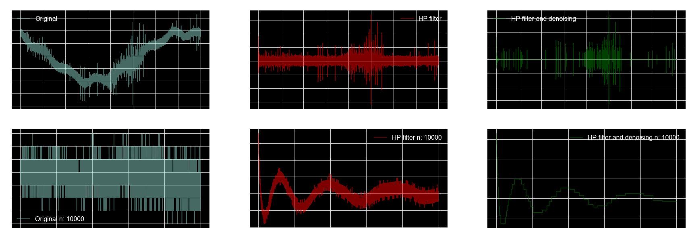
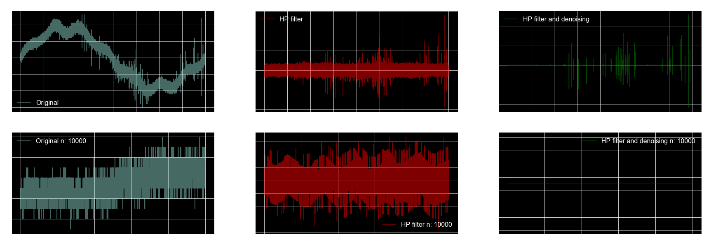
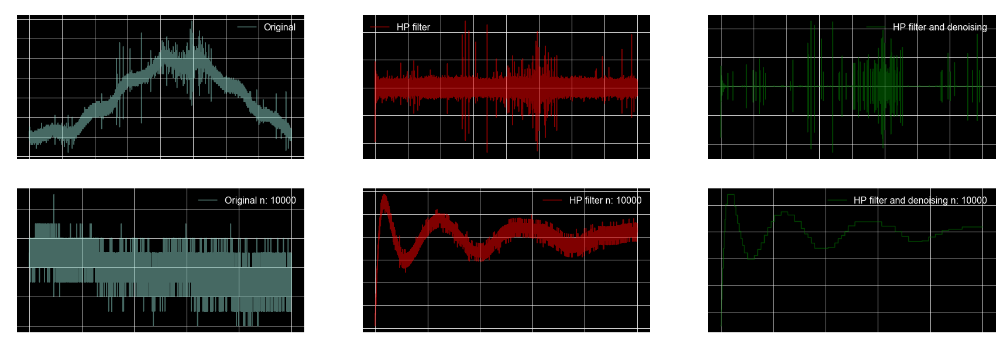

## Basic Data EDA
Understanding data / save figures


### Import library

```python
import numpy as np
import pandas as pd
import matplotlib.pyplot as plt
import seaborn as sns
import pyarrow.parquet as pq
import gc
import pywt
import scipy
from statsmodels.robust import mad
from scipy import signal
from scipy.signal import butter, find_peaks

import warnings
warnings.simplefilter(action='ignore', category=FutureWarning)


# matplotlib setting
%matplotlib inline
plt.style.use('seaborn-whitegrid')
plt.style.available[:10]
plt.rcParams["figure.figsize"] = [10,8]
plt.style.use('dark_background')
```

### Import data
```python
train_meta_df = pd.read_csv('../input/metadata_train.csv')
test_meta_df = pd.read_csv('../input/metadata_test.csv')
```

### Data size
```python
print("meta data - train (shape) : {}".format(train_meta_df.shape))
print("meta data - test (shape) : {}".format(test_meta_df.shape))
```

    meta data - train (shape) : (8712, 4)
    meta data - test (shape) : (20337, 3)
    

### Data head
```python
train_meta_df.head(6)
```


<table border="1" class="dataframe">
  <thead>
    <tr style="text-align: right;">
      <th></th>
      <th>signal_id</th>
      <th>id_measurement</th>
      <th>phase</th>
      <th>target</th>
    </tr>
  </thead>
  <tbody>
    <tr>
      <th>0</th>
      <td>0</td>
      <td>0</td>
      <td>0</td>
      <td>0</td>
    </tr>
    <tr>
      <th>1</th>
      <td>1</td>
      <td>0</td>
      <td>1</td>
      <td>0</td>
    </tr>
    <tr>
      <th>2</th>
      <td>2</td>
      <td>0</td>
      <td>2</td>
      <td>0</td>
    </tr>
    <tr>
      <th>3</th>
      <td>3</td>
      <td>1</td>
      <td>0</td>
      <td>1</td>
    </tr>
    <tr>
      <th>4</th>
      <td>4</td>
      <td>1</td>
      <td>1</td>
      <td>1</td>
    </tr>
    <tr>
      <th>5</th>
      <td>5</td>
      <td>1</td>
      <td>2</td>
      <td>1</td>
    </tr>
  </tbody>
</table>
</div>


```python
test_meta_df.head()
```


<div>
<style scoped>
    .dataframe tbody tr th:only-of-type {
        vertical-align: middle;
    }

    .dataframe tbody tr th {
        vertical-align: top;
    }

    .dataframe thead th {
        text-align: right;
    }
</style>
<table border="1" class="dataframe">
  <thead>
    <tr style="text-align: right;">
      <th></th>
      <th>signal_id</th>
      <th>id_measurement</th>
      <th>phase</th>
    </tr>
  </thead>
  <tbody>
    <tr>
      <th>0</th>
      <td>8712</td>
      <td>2904</td>
      <td>0</td>
    </tr>
    <tr>
      <th>1</th>
      <td>8713</td>
      <td>2904</td>
      <td>1</td>
    </tr>
    <tr>
      <th>2</th>
      <td>8714</td>
      <td>2904</td>
      <td>2</td>
    </tr>
    <tr>
      <th>3</th>
      <td>8715</td>
      <td>2905</td>
      <td>0</td>
    </tr>
    <tr>
      <th>4</th>
      <td>8716</td>
      <td>2905</td>
      <td>1</td>
    </tr>
  </tbody>
</table>
</div>


**Check Null**


```python
train_meta_df.isnull().sum()
```


    signal_id         0
    id_measurement    0
    phase             0
    target            0
    dtype: int64


```python
test_meta_df.isnull().sum()
```


    signal_id         0
    id_measurement    0
    phase             0
    dtype: int64


```python
import missingno as msno
msno.matrix(train_meta_df, figsize=(10,8))

```


    <matplotlib.axes._subplots.AxesSubplot at 0x1bf16850400>


## Check target
###  ax: array for two axis object


```python
fig, (ax1, ax2) = plt.subplots(1, 2, figsize=(14,4))
sns.countplot(x='target', data=train_meta_df, ax=ax1)
sns.countplot(x='target', data=train_meta_df, hue='phase', ax=ax2)

```


    <matplotlib.axes._subplots.AxesSubplot at 0x1bf168f04a8>


```python
target_count = train_meta_df['target'].value_counts()
print(type(target_count))
print(target_count.shape)
print('negatvie(target=0) : {}'.format(target_count[0]))
print('positvie(target=1) : {}'.format(target_count[1]))
```

    <class 'pandas.core.series.Series'>
    (2,)
    negatvie(target=0) : 8187
    positvie(target=1) : 525
    


```python
 train_meta_df['phase'].nunique()
```


    3


```python
phase_count = train_meta_df['phase'].value_counts()
print(type(phase_count))
print(phase_count.shape)
print('(phase=0) : {}'.format(phase_count[0]))
print('(phase=1) : {}'.format(phase_count[1]))
print('(phase=2) : {}'.format(phase_count[2]))
```

    <class 'pandas.core.series.Series'>
    (3,)
    (phase=0) : 2904
    (phase=1) : 2904
    (phase=2) : 2904
    


```python
 train_meta_df['target'].nunique()
```


    2


```python
miss = train_meta_df.groupby(['id_measurement']).sum().query('target !=3 & target != 0')
print('not all phase same positive or negative numbers : {}'.format(miss.shape[0]))
miss
```

    not all phase same positive or negative numbers : 38
    


<div>
<style scoped>
    .dataframe tbody tr th:only-of-type {
        vertical-align: middle;
    }

    .dataframe tbody tr th {
        vertical-align: top;
    }

    .dataframe thead th {
        text-align: right;
    }
</style>
<table border="1" class="dataframe">
  <thead>
    <tr style="text-align: right;">
      <th></th>
      <th>signal_id</th>
      <th>phase</th>
      <th>target</th>
    </tr>
    <tr>
      <th>id_measurement</th>
      <th></th>
      <th></th>
      <th></th>
    </tr>
  </thead>
  <tbody>
    <tr>
      <th>67</th>
      <td>606</td>
      <td>3</td>
      <td>2</td>
    </tr>
    <tr>
      <th>96</th>
      <td>867</td>
      <td>3</td>
      <td>1</td>
    </tr>
    <tr>
      <th>126</th>
      <td>1137</td>
      <td>3</td>
      <td>1</td>
    </tr>
    <tr>
      <th>159</th>
      <td>1434</td>
      <td>3</td>
      <td>1</td>
    </tr>
    <tr>
      <th>271</th>
      <td>2442</td>
      <td>3</td>
      <td>1</td>
    </tr>
    <tr>
      <th>301</th>
      <td>2712</td>
      <td>3</td>
      <td>1</td>
    </tr>
    <tr>
      <th>443</th>
      <td>3990</td>
      <td>3</td>
      <td>1</td>
    </tr>
    <tr>
      <th>518</th>
      <td>4665</td>
      <td>3</td>
      <td>1</td>
    </tr>
    <tr>
      <th>601</th>
      <td>5412</td>
      <td>3</td>
      <td>2</td>
    </tr>
    <tr>
      <th>608</th>
      <td>5475</td>
      <td>3</td>
      <td>2</td>
    </tr>
    <tr>
      <th>620</th>
      <td>5583</td>
      <td>3</td>
      <td>2</td>
    </tr>
    <tr>
      <th>706</th>
      <td>6357</td>
      <td>3</td>
      <td>2</td>
    </tr>
    <tr>
      <th>894</th>
      <td>8049</td>
      <td>3</td>
      <td>1</td>
    </tr>
    <tr>
      <th>944</th>
      <td>8499</td>
      <td>3</td>
      <td>2</td>
    </tr>
    <tr>
      <th>988</th>
      <td>8895</td>
      <td>3</td>
      <td>2</td>
    </tr>
    <tr>
      <th>1068</th>
      <td>9615</td>
      <td>3</td>
      <td>2</td>
    </tr>
    <tr>
      <th>1076</th>
      <td>9687</td>
      <td>3</td>
      <td>2</td>
    </tr>
    <tr>
      <th>1091</th>
      <td>9822</td>
      <td>3</td>
      <td>1</td>
    </tr>
    <tr>
      <th>1132</th>
      <td>10191</td>
      <td>3</td>
      <td>1</td>
    </tr>
    <tr>
      <th>1256</th>
      <td>11307</td>
      <td>3</td>
      <td>2</td>
    </tr>
    <tr>
      <th>1268</th>
      <td>11415</td>
      <td>3</td>
      <td>1</td>
    </tr>
    <tr>
      <th>1277</th>
      <td>11496</td>
      <td>3</td>
      <td>1</td>
    </tr>
    <tr>
      <th>1304</th>
      <td>11739</td>
      <td>3</td>
      <td>2</td>
    </tr>
    <tr>
      <th>1420</th>
      <td>12783</td>
      <td>3</td>
      <td>1</td>
    </tr>
    <tr>
      <th>1537</th>
      <td>13836</td>
      <td>3</td>
      <td>2</td>
    </tr>
    <tr>
      <th>1561</th>
      <td>14052</td>
      <td>3</td>
      <td>1</td>
    </tr>
    <tr>
      <th>1668</th>
      <td>15015</td>
      <td>3</td>
      <td>2</td>
    </tr>
    <tr>
      <th>1704</th>
      <td>15339</td>
      <td>3</td>
      <td>2</td>
    </tr>
    <tr>
      <th>1884</th>
      <td>16959</td>
      <td>3</td>
      <td>1</td>
    </tr>
    <tr>
      <th>1899</th>
      <td>17094</td>
      <td>3</td>
      <td>1</td>
    </tr>
    <tr>
      <th>1994</th>
      <td>17949</td>
      <td>3</td>
      <td>1</td>
    </tr>
    <tr>
      <th>2328</th>
      <td>20955</td>
      <td>3</td>
      <td>2</td>
    </tr>
    <tr>
      <th>2623</th>
      <td>23610</td>
      <td>3</td>
      <td>2</td>
    </tr>
    <tr>
      <th>2693</th>
      <td>24240</td>
      <td>3</td>
      <td>2</td>
    </tr>
    <tr>
      <th>2753</th>
      <td>24780</td>
      <td>3</td>
      <td>1</td>
    </tr>
    <tr>
      <th>2760</th>
      <td>24843</td>
      <td>3</td>
      <td>2</td>
    </tr>
    <tr>
      <th>2807</th>
      <td>25266</td>
      <td>3</td>
      <td>2</td>
    </tr>
    <tr>
      <th>2876</th>
      <td>25887</td>
      <td>3</td>
      <td>1</td>
    </tr>
  </tbody>
</table>
</div>


```python
train_meta_df['id_measurement'].value_counts().describe()
```


    count    2904.0
    mean        3.0
    std         0.0
    min         3.0
    25%         3.0
    50%         3.0
    75%         3.0
    max         3.0
    Name: id_measurement, dtype: float64


```python
subset_train = pq.read_pandas('../input/train.parquet', columns=[str(i) for i in range(20)]).to_pandas()
```


```python
subset_train.memory_usage(index=True).sum()
```


    16000080


```python
n_samples = subset_train.shape[0]
n_samples
```


    800000


```python
# sample duration : 20 ms
ts = 0.02 

sample_rate = n_samples * (1/ts)
print("Sampling Rates: %2d MHz" % (sample_rate/1000000))
print("Sampling Rates: {0:2d} MHz".format(int(sample_rate/1000000)))
```

    Sampling Rates: 40 MHz
    Sampling Rates: 40 MHz
    


```python
# 800,000 data points taken over 20 ms
# Grid operates at 50hz, 0.02 * 50 = 1, so 800k samples in 20 milliseconds will capture one complete cycle
n_samples = 800000

# Sample duration is 20 miliseconds
sample_duration = 0.02

# Sample rate is the number of samples in one second
# Sample rate will be 40mhz
sample_rate = n_samples * (1 / sample_duration)

# time array support
t = np.array([i / sample_rate for i in range(n_samples)])

# frequency vector for FFT
freqs = fftpack.fftfreq(n_samples, d=1/sample_rate)

# Mean Absolute Deviation
def maddest(d, axis=None):
    return np.mean(np.absolute(d - np.mean(d, axis)), axis)

# Synchronise all waveforms
# Adapted from https://www.kaggle.com/fernandoramacciotti/sync-waves-with-fft-coeffs
def sync_phase(x, align_value=0.5):
    
    # fft
    fft_coeffs = fftpack.fft(x)
    
    # asses dominant frequency
    coeff_norms = np.abs(fft_coeffs)  # get norms (fft coeffs are complex)
    max_idx = np.argmax(coeff_norms)
    max_coeff = fft_coeffs[max_idx]  # get max coeff
    max_freq = freqs[max_idx]  # assess which is the dominant frequency
    max_amp = (coeff_norms[max_idx] / n_samples) * 2  # times 2 because there are mirrored freqs
    if max_freq != 50:
        # print('Dominant frequency is {:,.1f}Hz with amplitude of {:,.1f}\n'.format(max_freq, max_amp))
        # print('Signal ID is {:,.1f} and its target is {:,.1f}\n'.format(metadata_train.signal_id[i], metadata_train.target[i]))
        return x, max_freq
    else:
            
        # phase shift
        phase_shift = np.angle(max_coeff)
    
        # get angular phase vector
        w = 2 * np.pi * t * max_freq + phase_shift
        w_norm = np.mod(w / (2 * np.pi), 1) * 2  # range between cycle of 0-2
    
        # idx to roll
        candidates = np.where(np.isclose(w_norm, align_value))
        # since we are in discrete time, threre could be many values close to the desired one
        # so take the median
        origin = int(np.median(candidates))
    
        # roll/sync signal
        sig_rolled = np.roll(x, n_samples - origin)
        return sig_rolled, max_freq

# High Pass Filter
# Adapted from https://github.com/randxie/Kaggle-VSB-Baseline/blob/master/src/utils/util_signal.py
def high_pass_filter(x, low_cutoff=1000, sample_rate=sample_rate):  # 1000 is default, correctly set to 10^4 below 
    
    # nyquist frequency (half the sample rate)
    nyquist = 0.5 * sample_rate
    norm_low_cutoff = low_cutoff / nyquist
    
    # Fault pattern usually exists in high frequency band. 
    # According to literature, the pattern is visible above 10^4 Hz.
    # For digital filters, Wn is normalized from 0 to 1, 
    # where 1 is the Nyquist frequency, pi radians/sample (Wn is thus in half-cycles / sample).
    sos = butter(10, Wn=[norm_low_cutoff], btype='highpass', output='sos')
    filtered_sig = signal.sosfilt(sos, x)

    return filtered_sig

# Discrete Wavelet Transform Denoising
# 1. Adapted from waveletSmooth function found here:
# http://connor-johnson.com/2016/01/24/using-pywavelets-to-remove-high-frequency-noise/
# 2. Threshold equation and using hard mode in threshold as mentioned
# in section '3.2 denoising based on optimized singular values' from the Vantuch thesis 
def denoise_signal(x, wavelet='db4', level=1):

    # Decompose to get the wavelet coefficients
    coeff = pywt.wavedec(x, wavelet, mode="per" )
    
    # Calculate sigma for threshold as defined in the Vantuch thesis, using Mean Absolute Deviation
    sigma = (1/0.6745) * maddest( coeff[-level] )  # eqn 3.8 

    # Calculte the univeral threshold
    uthresh = sigma * np.sqrt( 2*np.log( len( x ) ) )  # eqn 3.9
    coeff[1:] = (pywt.threshold( i, value=uthresh, mode='hard' ) for i in coeff[1:] )
    
    # Reconstruct the signal using the thresholded coefficients
    return pywt.waverec(coeff, wavelet, mode='per')

# Cancel False Peaks
# Such as those from corona discharges
# Adapted from https://www.kaggle.com/jeffreyegan/vsb-power-line-fault-detection-approach
def cancel_false_peaks(signal, peak_indexes, min_height_fp=50):

    false_peak_indexes = []
    min_height_fp = min_height_fp
    max_sym_distance = 20 
    max_pulse_train = 750  
    max_height_ratio = 1.25 
    min_height_ratio = 0.25
    for pk in range(len(peak_indexes)-1):
        if not peak_indexes[pk] in false_peak_indexes:
            if (signal[peak_indexes[pk]] > min_height_fp and signal[peak_indexes[pk+1]] < 0) and (peak_indexes[pk+1] - peak_indexes[pk]) < max_sym_distance:
                # if 1 > abs(signal[peak_indexes[pk+1]])/abs(signal[peak_indexes[pk]]) > max_height_ratio:
                if max_height_ratio > abs(signal[peak_indexes[pk+1]])/abs(signal[peak_indexes[pk]]) > min_height_ratio:
                    for x in range(len(peak_indexes)):
                        if peak_indexes[pk] <= peak_indexes[x] <= peak_indexes[pk]+max_pulse_train:
                            false_peak_indexes.append(peak_indexes[x]) 
                        
            if (signal[peak_indexes[pk]] < -min_height_fp and signal[peak_indexes[pk+1]] > 0) and (peak_indexes[pk+1] - peak_indexes[pk]) < max_sym_distance:
                if max_height_ratio > abs(signal[peak_indexes[pk+1]])/abs(signal[peak_indexes[pk]]) > min_height_ratio:
                    for x in range(len(peak_indexes)):
                        if peak_indexes[pk] <= peak_indexes[x] <= peak_indexes[pk]+max_pulse_train:
                            false_peak_indexes.append(peak_indexes[x])
                            
    true_peak_indexes = list(set(peak_indexes) - set(false_peak_indexes))
    
    return np.array(true_peak_indexes, dtype=np.int32), np.array(false_peak_indexes, dtype=np.int32)


# Extract Peak and Valley Features
def pv_features(x_dn, pv_true, peaks, valleys, rel_height=0.2):

    # p=peaks, v=valleys, h=height, w=width
    true_peaks = np.array(list(set(peaks) & set(pv_true)), dtype=np.int32)  # intersection of true peaks/valleys and peaks
    if true_peaks.shape[0] == 0:
        p_n = 0 
        ph_mean = 0
        ph_max = 0
        pw_mean = 0
        pw_max = 0
    else:
        p_n = true_peaks.shape[0]
        peak_heights, _ , _ = signal.peak_prominences(x_dn, true_peaks)
        peak_heights = np.vstack((x_dn[true_peaks], peak_heights)).min(axis=0)
        ph_mean = peak_heights.mean()
        ph_max = peak_heights.max()
        peak_widths, peak_width_heights, peak_left_ips , peak_right_ips = signal.peak_widths(x_dn, true_peaks, rel_height=rel_height)
        pw_mean = peak_widths.mean()
        pw_max = peak_widths.max()
    
    true_valleys = np.array(list(set(valleys) & set(pv_true)), dtype=np.int32)  # intersection of true peaks/valleys and valleys
    if true_valleys.shape[0] == 0:
        v_n = 0 
        vh_mean = 0
        vh_max = 0
        vw_mean = 0
        vw_max = 0
    else:
        v_n = true_valleys.shape[0]
        valley_heights, _ , _ = signal.peak_prominences(-x_dn, true_valleys)
        valley_heights = np.vstack((-x_dn[true_valleys], valley_heights)).min(axis=0)
        vh_mean = valley_heights.mean()
        vh_max = valley_heights.max()
        valley_widths, valley_width_heights, valley_left_ips , valley_right_ips = signal.peak_widths(-x_dn, true_valleys, rel_height=rel_height)
        vw_mean = valley_widths.mean()
        vw_max = valley_widths.max()
        
    return np.array([p_n, ph_mean, ph_max, pw_mean, pw_max, v_n, vh_mean, vh_max, vw_mean, vw_max])
    
```


```python
def maddest(d, axis=None):
    """ 
    Mean Absolute Deviation
    """
    return np.mean(np.absolute(d - np.mean(d, axis)), axis)


```


```python
def high_pass_filter(x, low_cutoff=1000, sample_rate=sample_rate):
    """
    From @randxie https://github.com/randxie/Kaggle-VSB-Baseline/blob/master/src/utils/util_signal.py
    Modified to work with scipy version 1.1.0 which does not have the fs parameter
    """
    # nyquist frequency is half the sample rate https://enwikipedia.org/wiki/Nyquist_frequency
    nyquist = 0.5 * sample_rate
    norm_low_cutoff = low_cutoff / nyquist
    # Fault pattern usually exists in high frequency band. According to literature, the pattern is visible above 10^4 Hz.
    # scipy version 1.2.0
    #sos = butter(10, low_freq, btype='hp', fs=sample_fs, output='sos')
    
    # scipy version 1.1.0
    sos = butter(10, Wn = [norm_low_cutoff], btype='highpass', output='sos')
    filtered_sig = signal.sosfilt(sos, x)
    
    return filtered_sig


```


```python
def denoise_signal(x, wavelet='db4', level=1):
    """
    1. Adapted from waveletSmooth function found here:
    http://connor-johnson.com/2016/01/24/using-pywavelets-to-remove-high-frequency-noise/
    2. Threshold equation and using hard mode in threshold as mentioned
    in section '3.2 denoising based on optimized singular values' from paper by Tomas Vantuch:
    http://dspace.vsb.cz/bitstream/handle/10084/133114/VAN431_FEI_P1807_1801V001_2018.pdf
    """
    
    # Decompose to get the wavelet coefficients
    coeff = pywt.wavedec(x, wavelet, mode='per')
    
    # Calculate sigma for threshold as defined in http://dspace.vsb.cz/bitstream/handle/10084/133114/VAN431_FEI_P1807_1801V001_2018.pdf
    # As noted by @harshit92 MAD referred to in the paper is Mean Absolute Deviation not Median Absolute Deviation    
    sigma = (1/0.6745) * maddest(coeff[-level])
    
    # calculate the universal threshold
    uthresh = sigma * np.sqrt( 2*np.log( len( x ) ) )
    coeff[1:] = ( pywt.threshold( i, value=uthresh, mode='hard' ) for i in coeff[1:] )
    
    # Reconstruct the signal using the thresholded coefficients
    return pywt.waverec( coeff, wavelet, mode='per' )   
```


```python
metadata_train =pd.read_csv('../input/metadata_train.csv')
from scipy.signal import butter
train_length = 3
for i in range(train_length):
    signal_id = str(i)
    meta_row = metadata_train[metadata_train['signal_id'] == i]
    measurement = str(meta_row['id_measurement'].values[0])
    signal_id = str(meta_row['signal_id'].values[0])
    phase = str(meta_row['phase'].values[0])
    
    subset_train_row = subset_train[signal_id]
    
    # Apply high pass filter with low cutoff of 10kHz, this will remove the low frequency 50Hz sinusoidal motion in the signal
    x_hp = high_pass_filter(subset_train_row, low_cutoff=10000, sample_rate=sample_rate)
    
    # Apply denoising
    x_dn = denoise_signal(x_hp, wavelet='haar', level=1)
    
    slice_size = 10000
    font_size = 16
    
    fig, ax = plt.subplots(nrows=2, ncols=3, figsize=(30, 10))
    
    ax[0, 0].plot(subset_train_row, alpha=0.5)
    ax[0, 0].set_title(f"m: {measurement}, signal id: {signal_id}, phase: {phase}", fontsize=font_size)
    ax[0, 0].legend(['Original'], fontsize=font_size)
    
    # Show smaller slice of the signal to get a better idea of the effect the high pass frequency filter is having on the signal
    ax[1, 0].plot(subset_train_row[:slice_size], alpha=0.5)
    ax[1, 0].set_title(f"m: {measurement}, signal id: {signal_id}, phase: {phase}", fontsize=font_size)
    ax[1, 0].legend([f"Original n: {slice_size}"], fontsize=font_size)
    
    ax[0, 1].plot(x_hp, 'r', alpha=0.5)
    ax[0, 1].set_title(f"m: {measurement}, signal id: {signal_id}, phase: {phase}", fontsize=font_size)
    ax[0, 1].legend(['HP filter'], fontsize=font_size)
    ax[1, 1].plot(x_hp[:slice_size], 'r', alpha=0.5)
    ax[1, 1].set_title(f"m: {measurement}, signal id: {signal_id}, phase: {phase}", fontsize=font_size)
    ax[1, 1].legend([f"HP filter n: {slice_size}"], fontsize=font_size)
    
    ax[0, 2].plot(x_dn, 'g', alpha=0.5)
    ax[0, 2].set_title(f"m: {measurement}, signal id: {signal_id}, phase: {phase}", fontsize=font_size)
    ax[0, 2].legend(['HP filter and denoising'], fontsize=font_size)
    ax[1, 2].plot(x_dn[:slice_size], 'g', alpha=0.5)
    ax[1, 2].set_title(f"m: {measurement}, signal id: {signal_id}, phase: {phase}", fontsize=font_size)
    ax[1, 2].legend([f"HP filter and denoising n: {slice_size}"], fontsize=font_size)
    

    plt.show()
```











### Exploratory Plot2

 Plot the first 21 signals (filtered and denoised) zoomed in on 2000
https://www.kaggle.com/kmekar/vsb-fault-detection-dwt-denoising


```python
train_length = subset_train.shape[1]

for i in range(train_length):
    signal_id = str(i)
    meta_row = metadata_train[metadata_train['signal_id'] == i]
    measurement = str(meta_row['id_measurement'].values[0])
    signal_id = str(meta_row['signal_id'].values[0])
    phase = str(meta_row['phase'].values[0])
    target = str(meta_row['target'].values[0])
    
    subset_train_row = subset_train[signal_id]
    
    # Apply high pass filter with low cutoff of 10kHz, this will remove the low frequency 50Hz sinusoidal motion in the signal
    x_hp = high_pass_filter(subset_train_row, low_cutoff=10000, sample_rate=sample_rate)
    
    # Apply denoising
    x_dn = denoise_signal(x_hp, wavelet='haar', level=1)
    
    start = 116000
    slice_size = 2000
    
    # Find peaks
    peaks, peak_properties = find_peaks(x_dn[start:start+slice_size], height=0.1, width=0, rel_height=0.2)
    valleys, valley_properties = find_peaks(-x_dn[start:start+slice_size], height=0.1, width=0, rel_height=0.2)
    all_peaks = np.sort(np.concatenate((peaks, valleys)))
    
    # Cancel false peaks
    true_pv, false_pv = cancel_false_peaks(x_dn[start:start+slice_size], all_peaks, min_height_fp=15)
    true_peaks = np.array(list(set(peaks) & set(true_pv)), dtype=np.int32)  # intersection of true peaks/valleys and peaks
    true_valleys = np.array(list(set(valleys) & set(true_pv)), dtype=np.int32)  # intersection of true peaks/valleys and valleys 
    
    # Calculate heights and widths of true peaks
    peak_heights, _ , _ = signal.peak_prominences(x_dn[start:start+slice_size], true_peaks)
    peak_heights = np.vstack((x_dn[start+true_peaks], peak_heights)).min(axis=0)
    peak_widths, peak_width_heights, peak_left_ips , peak_right_ips = signal.peak_widths(x_dn[start:start+slice_size], true_peaks, rel_height=0.2)
    
    valley_heights, _ , _ = signal.peak_prominences(-x_dn[start:start+slice_size], true_valleys)
    valley_heights = np.vstack((-x_dn[start+true_valleys], valley_heights)).min(axis=0)
    valley_widths, valley_width_heights, valley_left_ips , valley_right_ips = signal.peak_widths(-x_dn[start:start+slice_size], true_valleys, rel_height=0.2)
    
    # Plot
    font_size = 16
    plt.figure(figsize=(30,8))
    plt.plot(x_dn[start:start+slice_size], 'g', alpha=0.5)
    plt.scatter(true_peaks, x_dn[start+true_peaks], marker="x", color="b", label="True Peaks")
    plt.scatter(false_pv, x_dn[start+false_pv], marker="x", color="red", label="Cancelled Peaks")
    plt.vlines(x=true_peaks, ymin=x_dn[start+true_peaks] - peak_heights, ymax = x_dn[start+true_peaks], color = "C1")
    plt.hlines(y=peak_width_heights, xmin=peak_left_ips, xmax=peak_right_ips, color = "C1")
    ## Valleys
    plt.scatter(true_valleys, x_dn[start+true_valleys], marker="x", color="b", label="True Valleys")
    plt.vlines(x=true_valleys, ymin=x_dn[start+true_valleys] , ymax = x_dn[start+true_valleys] + valley_heights, color = "C1")
    plt.hlines(y=-valley_width_heights, xmin=valley_left_ips, xmax=valley_right_ips, color = "C1")
    
    plt.title(f"measurement id: {measurement}, signal id: {signal_id}, phase: {phase}, target: {target}", fontsize=font_size)
    plt.show()
    
```


```python
train_length = subset_train.shape[1]

for i in range(train_length):
    signal_id = str(i)
    meta_row = metadata_train[metadata_train['signal_id'] == i]
    measurement = str(meta_row['id_measurement'].values[0])
    signal_id = str(meta_row['signal_id'].values[0])
    phase = str(meta_row['phase'].values[0])
    target = str(meta_row['target'].values[0])
    
    subset_train_row = subset_train[signal_id]
    
    # Apply high pass filter with low cutoff of 10kHz, this will remove the low frequency 50Hz sinusoidal motion in the signal
    x_hp = high_pass_filter(subset_train_row, low_cutoff=10000, sample_rate=sample_rate)
    
    # Apply denoising
    x_dn = denoise_signal(x_hp, wavelet='haar', level=1)
    
    start = 116000
    slice_size = 2000
    
    # Find peaks
    peaks, peak_properties = find_peaks(x_dn[start:start+slice_size], height=0.1, width=0, rel_height=0.2)
    valleys, valley_properties = find_peaks(-x_dn[start:start+slice_size], height=0.1, width=0, rel_height=0.2)
    all_peaks = np.sort(np.concatenate((peaks, valleys)))
    
    # Cancel false peaks
    true_pv, false_pv = cancel_false_peaks(x_dn[start:start+slice_size], all_peaks, min_height_fp=15)
    true_peaks = np.array(list(set(peaks) & set(true_pv)), dtype=np.int32)  # intersection of true peaks/valleys and peaks
    true_valleys = np.array(list(set(valleys) & set(true_pv)), dtype=np.int32)  # intersection of true peaks/valleys and valleys 
    
    # Calculate heights and widths of true peaks
    peak_heights, _ , _ = signal.peak_prominences(x_dn[start:start+slice_size], true_peaks)
    peak_heights = np.vstack((x_dn[start+true_peaks], peak_heights)).min(axis=0)
    peak_widths, peak_width_heights, peak_left_ips , peak_right_ips = signal.peak_widths(x_dn[start:start+slice_size], true_peaks, rel_height=0.2)
    
    valley_heights, _ , _ = signal.peak_prominences(-x_dn[start:start+slice_size], true_valleys)
    valley_heights = np.vstack((-x_dn[start+true_valleys], valley_heights)).min(axis=0)
    valley_widths, valley_width_heights, valley_left_ips , valley_right_ips = signal.peak_widths(-x_dn[start:start+slice_size], true_valleys, rel_height=0.2)
    
    # Plot
    font_size = 16
    plt.figure(figsize=(30,8))
    plt.plot(x_dn[start:start+slice_size], 'g', alpha=0.5)
    plt.scatter(true_peaks, x_dn[start+true_peaks], marker="x", color="b", label="True Peaks")
    plt.scatter(false_pv, x_dn[start+false_pv], marker="x", color="red", label="Cancelled Peaks")
    plt.vlines(x=true_peaks, ymin=x_dn[start+true_peaks] - peak_heights, ymax = x_dn[start+true_peaks], color = "C1")
    plt.hlines(y=peak_width_heights, xmin=peak_left_ips, xmax=peak_right_ips, color = "C1")
    ## Valleys
    plt.scatter(true_valleys, x_dn[start+true_valleys], marker="x", color="b", label="True Valleys")
    plt.vlines(x=true_valleys, ymin=x_dn[start+true_valleys] , ymax = x_dn[start+true_valleys] + valley_heights, color = "C1")
    plt.hlines(y=-valley_width_heights, xmin=valley_left_ips, xmax=valley_right_ips, color = "C1")
    
    plt.title(f"measurement id: {measurement}, signal id: {signal_id}, phase: {phase}, target: {target}", fontsize=font_size)
    plt.show()
```


    ---------------------------------------------------------------------------

    NameError                                 Traceback (most recent call last)

    <ipython-input-29-eeea9fbb49a8> in <module>
         26 
         27     # Cancel false peaks
    ---> 28     true_pv, false_pv = cancel_false_peaks(x_dn[start:start+slice_size], all_peaks, min_height_fp=15)
         29     true_peaks = np.array(list(set(peaks) & set(true_pv)), dtype=np.int32)  # intersection of true peaks/valleys and peaks
         30     true_valleys = np.array(list(set(valleys) & set(true_pv)), dtype=np.int32)  # intersection of true peaks/valleys and valleys
    

    NameError: name 'cancel_false_peaks' is not defined


### Load Train Dataset
Note: dataset occupies 6.5GB of RAM, but ~15GB is needed while loading the dataset
if you do not have this much RAM available, load and process the data in chunks as I have done with the larger test set below


